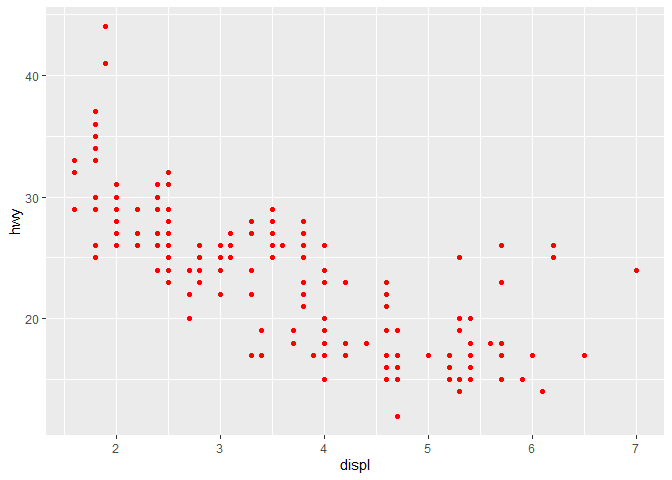

week1 homework
================
2022-07-07

R markdown은 **R studio**에서 markdown 스크립트를 작성할 수 있게 해주는
형식이다.

# (1) Cheetsheets

<https://www.rstudio.com/resources/cheatsheets/>

------------------------------------------------------------------------

| 제목       | 내용       |
|:-----------|:-----------|
| 안녕하세요 | 안녕하세요 |

``` r
# install.packages("tidyverse")
library(tidyverse)
```

    ## ── Attaching packages ─────────────────────────────────────── tidyverse 1.3.1 ──

    ## ✔ ggplot2 3.3.6     ✔ purrr   0.3.4
    ## ✔ tibble  3.1.7     ✔ dplyr   1.0.9
    ## ✔ tidyr   1.2.0     ✔ stringr 1.4.0
    ## ✔ readr   2.1.2     ✔ forcats 0.5.1

    ## ── Conflicts ────────────────────────────────────────── tidyverse_conflicts() ──
    ## ✖ dplyr::filter() masks stats::filter()
    ## ✖ dplyr::lag()    masks stats::lag()

``` r
head(mpg)
```

    ## # A tibble: 6 × 11
    ##   manufacturer model displ  year   cyl trans      drv     cty   hwy fl    class 
    ##   <chr>        <chr> <dbl> <int> <int> <chr>      <chr> <int> <int> <chr> <chr> 
    ## 1 audi         a4      1.8  1999     4 auto(l5)   f        18    29 p     compa…
    ## 2 audi         a4      1.8  1999     4 manual(m5) f        21    29 p     compa…
    ## 3 audi         a4      2    2008     4 manual(m6) f        20    31 p     compa…
    ## 4 audi         a4      2    2008     4 auto(av)   f        21    30 p     compa…
    ## 5 audi         a4      2.8  1999     6 auto(l5)   f        16    26 p     compa…
    ## 6 audi         a4      2.8  1999     6 manual(m5) f        18    26 p     compa…

``` r
str(mpg)
```

    ## tibble [234 × 11] (S3: tbl_df/tbl/data.frame)
    ##  $ manufacturer: chr [1:234] "audi" "audi" "audi" "audi" ...
    ##  $ model       : chr [1:234] "a4" "a4" "a4" "a4" ...
    ##  $ displ       : num [1:234] 1.8 1.8 2 2 2.8 2.8 3.1 1.8 1.8 2 ...
    ##  $ year        : int [1:234] 1999 1999 2008 2008 1999 1999 2008 1999 1999 2008 ...
    ##  $ cyl         : int [1:234] 4 4 4 4 6 6 6 4 4 4 ...
    ##  $ trans       : chr [1:234] "auto(l5)" "manual(m5)" "manual(m6)" "auto(av)" ...
    ##  $ drv         : chr [1:234] "f" "f" "f" "f" ...
    ##  $ cty         : int [1:234] 18 21 20 21 16 18 18 18 16 20 ...
    ##  $ hwy         : int [1:234] 29 29 31 30 26 26 27 26 25 28 ...
    ##  $ fl          : chr [1:234] "p" "p" "p" "p" ...
    ##  $ class       : chr [1:234] "compact" "compact" "compact" "compact" ...

``` r
# dot plot
# aes = aesthetic

ggplot(data = mpg) +
  geom_point(mapping = aes(x = displ, y = hwy)) # y: int x: num
```

<!-- -->

``` r
ggplot(mpg) +
  geom_point(mapping = aes(x = displ, y = hwy), color = "red") # the color of the points
```

<!-- -->

``` r
ggplot(mpg) +
  geom_point(mapping = aes(x = displ, y = hwy, color = "red")) # with the legend
```

<!-- -->

``` r
ggplot(data = mpg) + 
  geom_point(mapping = aes(x = displ, y = hwy, color = displ < 5)) # diff color with the threshold
```

<!-- -->

``` r
ggplot(mpg) +
  geom_point(mapping = aes(x = displ, y = hwy, size = class)) # with the legend
```

    ## Warning: Using size for a discrete variable is not advised.

<!-- -->

``` r
ggplot(mpg) +
  geom_point(mapping = aes(x = displ, y = hwy, alpha = class)) # the opacity of a geom
```

    ## Warning: Using alpha for a discrete variable is not advised.

<!-- -->

``` r
# alpha range from 0 to 1
# lower values correspond to more transparent colors
ggplot(data = mpg) + 
  geom_point(mapping = aes(x = displ, y = hwy), alpha = 0.2)
```

<!-- -->

``` r
ggplot(data = mpg) + 
  geom_point(mapping = aes(x = displ, y = hwy), alpha = 0.8)
```

<!-- -->

``` r
# bar plot

ggplot(mpg) +
  geom_bar(mapping = aes(x = class, fill = "red")) # x: chr
```

<!-- -->

## (2) 면분할

``` r
# facet
ggplot(mpg) +
  geom_point(mapping = aes(x = displ, y = hwy)) +
  facet_wrap(~ class, nrow = 2) # divide into class
```

<!-- -->

``` r
ggplot(mpg) +
  geom_point(mapping = aes(x = displ, y = hwy)) +
  facet_grid(drv ~ cyl) # drv = chr, cyl = int
```

<!-- -->

``` r
ggplot(data = mpg) +
  geom_point(mapping = aes(x = displ, y = hwy)) +
  facet_grid(. ~ drv)
```

<!-- -->

``` r
str(diamonds)
```

    ## tibble [53,940 × 10] (S3: tbl_df/tbl/data.frame)
    ##  $ carat  : num [1:53940] 0.23 0.21 0.23 0.29 0.31 0.24 0.24 0.26 0.22 0.23 ...
    ##  $ cut    : Ord.factor w/ 5 levels "Fair"<"Good"<..: 5 4 2 4 2 3 3 3 1 3 ...
    ##  $ color  : Ord.factor w/ 7 levels "D"<"E"<"F"<"G"<..: 2 2 2 6 7 7 6 5 2 5 ...
    ##  $ clarity: Ord.factor w/ 8 levels "I1"<"SI2"<"SI1"<..: 2 3 5 4 2 6 7 3 4 5 ...
    ##  $ depth  : num [1:53940] 61.5 59.8 56.9 62.4 63.3 62.8 62.3 61.9 65.1 59.4 ...
    ##  $ table  : num [1:53940] 55 61 65 58 58 57 57 55 61 61 ...
    ##  $ price  : int [1:53940] 326 326 327 334 335 336 336 337 337 338 ...
    ##  $ x      : num [1:53940] 3.95 3.89 4.05 4.2 4.34 3.94 3.95 4.07 3.87 4 ...
    ##  $ y      : num [1:53940] 3.98 3.84 4.07 4.23 4.35 3.96 3.98 4.11 3.78 4.05 ...
    ##  $ z      : num [1:53940] 2.43 2.31 2.31 2.63 2.75 2.48 2.47 2.53 2.49 2.39 ...

``` r
# bar plot
ggplot(diamonds) +
  geom_bar(mapping = aes(x = cut)) 
```

<!-- -->

``` r
ggplot(diamonds) +
  geom_bar(mapping = aes(x = cut, fill = cut)) # fill the bar with diff color, legend
```

<!-- -->

``` r
ggplot(diamonds) +
  geom_bar(mapping = aes(x = cut, fill = clarity)) # divide each level of the bar with clarity
```

<!-- -->

``` r
ggplot(diamonds) +
  geom_bar(mapping = aes(x = cut, fill = clarity), position = "dodge") # same with the plot below
```

<!-- -->

``` r
ggplot(data = diamonds, mapping = aes(x = cut, fill = clarity)) +
  geom_bar(position = "dodge")
```

<!-- -->

## (3) 좌표계

``` r
# coord
ggplot(data = diamonds) +
  geom_bar(mapping = aes(x = cut, fill = clarity), position = "dodge") + 
  coord_flip() # 축 바꿈
```

<!-- -->

``` r
ggplot(data = diamonds, mapping = aes(x = cut, fill = clarity)) +
  geom_bar(position = "dodge") +
  coord_polar() # 극좌표
```

<!-- -->

``` r
str(diamonds)
```

    ## tibble [53,940 × 10] (S3: tbl_df/tbl/data.frame)
    ##  $ carat  : num [1:53940] 0.23 0.21 0.23 0.29 0.31 0.24 0.24 0.26 0.22 0.23 ...
    ##  $ cut    : Ord.factor w/ 5 levels "Fair"<"Good"<..: 5 4 2 4 2 3 3 3 1 3 ...
    ##  $ color  : Ord.factor w/ 7 levels "D"<"E"<"F"<"G"<..: 2 2 2 6 7 7 6 5 2 5 ...
    ##  $ clarity: Ord.factor w/ 8 levels "I1"<"SI2"<"SI1"<..: 2 3 5 4 2 6 7 3 4 5 ...
    ##  $ depth  : num [1:53940] 61.5 59.8 56.9 62.4 63.3 62.8 62.3 61.9 65.1 59.4 ...
    ##  $ table  : num [1:53940] 55 61 65 58 58 57 57 55 61 61 ...
    ##  $ price  : int [1:53940] 326 326 327 334 335 336 336 337 337 338 ...
    ##  $ x      : num [1:53940] 3.95 3.89 4.05 4.2 4.34 3.94 3.95 4.07 3.87 4 ...
    ##  $ y      : num [1:53940] 3.98 3.84 4.07 4.23 4.35 3.96 3.98 4.11 3.78 4.05 ...
    ##  $ z      : num [1:53940] 2.43 2.31 2.31 2.63 2.75 2.48 2.47 2.53 2.49 2.39 ...

``` r
diamonds_test <- sample(1:nrow(diamonds), size = 1000, replace = FALSE)
diamonds_test <- diamonds[diamonds_test,]
fit_lr <- lm(price ~ carat + cut + clarity, data = diamonds_test)

pred <- fit_lr$fitted.values
real <- diamonds_test$price
```

``` r
ggplot(data = data.frame(x = diamonds_test$carat, pred = pred, real = real)) +
  geom_point(mapping = aes(x = x, y = real, color = "black")) +
  geom_point(mapping = aes(x = x, y = pred, color = "red"), alpha = 0.5) +
  scale_colour_manual(values = c("black", "red"),
                      labels = c("real", "pred"),
                      name = "real / pred") +
  geom_smooth(mapping = aes(x = x, y = pred, color = "red")) +
  geom_smooth(mapping = aes(x = x, y = real, color = "black")) +
  labs(x = "carat", y = "price", title = "diamonds data regression")
```

    ## `geom_smooth()` using method = 'gam' and formula 'y ~ s(x, bs = "cs")'
    ## `geom_smooth()` using method = 'gam' and formula 'y ~ s(x, bs = "cs")'

<!-- -->
