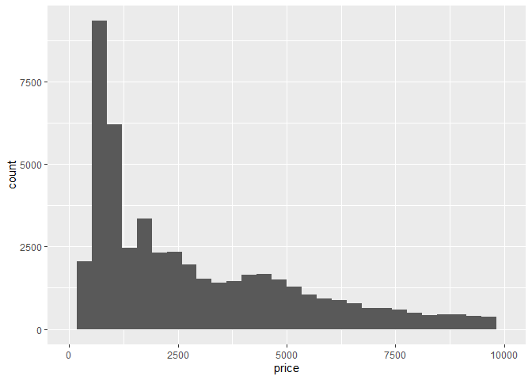
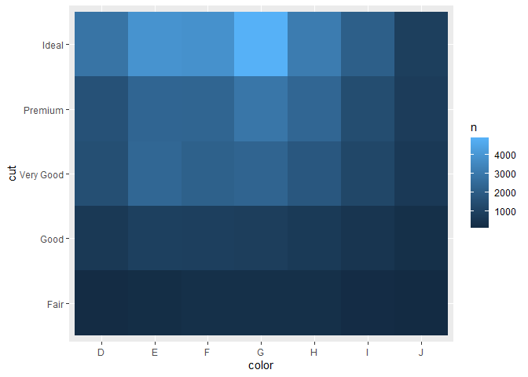

week2 homework
================
2022-07-10

# 1. 라이브러리 설정하기

``` r
library(tidyverse)
```

    ## ── Attaching packages ─────────────────────────────────────── tidyverse 1.3.1 ──

    ## ✔ ggplot2 3.3.6     ✔ purrr   0.3.4
    ## ✔ tibble  3.1.7     ✔ dplyr   1.0.9
    ## ✔ tidyr   1.2.0     ✔ stringr 1.4.0
    ## ✔ readr   2.1.2     ✔ forcats 0.5.1

    ## ── Conflicts ────────────────────────────────────────── tidyverse_conflicts() ──
    ## ✖ dplyr::filter() masks stats::filter()
    ## ✖ dplyr::lag()    masks stats::lag()

``` r
library(dplyr)
library(MASS)
```

    ## 
    ## 다음의 패키지를 부착합니다: 'MASS'

    ## The following object is masked from 'package:dplyr':
    ## 
    ##     select

# 2. 데이터 타입

``` r
# numeric
x1 <- 10 #integer
x2 <- 10.2 #double

# character
x3 <- "hello"

# logical
x4 <- TRUE
x5 <- FALSE
```

## (1) 타입 확인 변수

``` r
mode(x1)
```

    ## [1] "numeric"

``` r
mode(x2)
```

    ## [1] "numeric"

``` r
mode(x3)
```

    ## [1] "character"

``` r
mode(x4)
```

    ## [1] "logical"

``` r
typeof(x1)
```

    ## [1] "double"

## (2) 데이터 타입 변환

``` r
as.character(x1)
```

    ## [1] "10"

``` r
x1 <- as.character(x1)

as.character(x4)
```

    ## [1] "TRUE"

``` r
x4 <- as.numeric(x4)

as.character(x5)
```

    ## [1] "FALSE"

``` r
x5 <- as.numeric(x5)
```

# 연산자

## (1) 산술 연산자

``` r
3 + 4
```

    ## [1] 7

``` r
3 - 4
```

    ## [1] -1

``` r
3 * 4
```

    ## [1] 12

``` r
3 ** 4 # 거듭제곱
```

    ## [1] 81

``` r
3 ^ 4 # 거듭제곱
```

    ## [1] 81

``` r
4 %% 3 # 나눗셈(몫만 구하기)
```

    ## [1] 1

``` r
13 %% 4 # 나눗셈(나머지만 구하기)
```

    ## [1] 1

## (2) 비교 연산자

``` r
3 > 4
```

    ## [1] FALSE

``` r
3 >= 4
```

    ## [1] FALSE

``` r
3 < 4
```

    ## [1] TRUE

``` r
3 <= 4
```

    ## [1] TRUE

``` r
3 == 4
```

    ## [1] FALSE

``` r
3 != 4
```

    ## [1] TRUE

``` r
!(3 == 4)
```

    ## [1] TRUE

``` r
x <- c(1, 2, 3)
y <- c(4, 1, 7)

x > y
```

    ## [1] FALSE  TRUE FALSE

## (3) 논리 연산자

``` r
# &&: 그리고
(3 > 4) && (3 < 4)
```

    ## [1] FALSE

``` r
# ||: 또는
(3 > 4) || (3 < 4) # |: 하나도 가능
```

    ## [1] TRUE

# 3. R의 자료구조 (컴공 2학년)

## (1) Vector

하나의 열(column)로 구성되어 있음. 1차원 구조

데이터 분석의 기본 단위가 됨.

하나의 유형만 가질 수 있다. (수치, 문자, 논리)

``` r
num_vector <- c(1, 2, 3, 4, 5)
character_vector <- c("가", "나", "다", "라", "마")
logical_vector <- c(FALSE, FALSE, TRUE, TRUE, TRUE)
```

### vector 초기값

``` r
vector(mode = "numeric", length = 10)
```

    ##  [1] 0 0 0 0 0 0 0 0 0 0

``` r
vector(mode = "character", length = 10)
```

    ##  [1] "" "" "" "" "" "" "" "" "" ""

``` r
vector(mode = "logical", length = 10)
```

    ##  [1] FALSE FALSE FALSE FALSE FALSE FALSE FALSE FALSE FALSE FALSE

### vector 이름 설정

``` r
height <- c(160, 170, 180)
names(height)
```

    ## NULL

``` r
names(height) <- c("A", "B", "c")
height
```

    ##   A   B   c 
    ## 160 170 180

``` r
height["B"]
```

    ##   B 
    ## 170

### vector 정보 확인하기

``` r
length(height) # 벡터길이
```

    ## [1] 3

``` r
mode(height) # 벡터타입
```

    ## [1] "numeric"

``` r
is.vector(height)
```

    ## [1] TRUE

### vector 인덱싱/슬라이싱

``` r
weight <- c(10, 50, 70, 55, 56, 32)

# 1번째 요소를 보고싶다
weight[1]
```

    ## [1] 10

``` r
# 3번째 요소를 보고싶다
weight[3]
```

    ## [1] 70

``` r
# 1, 3, 5번째 요소를 보고싶다
weight[c(1, 3, 5)]
```

    ## [1] 10 70 56

``` r
# 짝수 element 확인하고 싶다
weight[seq(from = 2, to = 6, by = 2)]
```

    ## [1] 50 55 32

``` r
# 홀수 element 확인하고 싶다
weight[seq(from = 1, to =5, by = 2)]
```

    ## [1] 10 70 56

``` r
# 슬라이싱
weight[2:length(weight)]
```

    ## [1] 50 70 55 56 32

``` r
weight[2:4]
```

    ## [1] 50 70 55

### Vectorization, Recycling Rule

``` r
x <- c(1, 2, 3, 4, 5)
y <- c(10, 20, 30, 40, 50)
z <- c(1, 2, 3)

# vectorization
x + y
```

    ## [1] 11 22 33 44 55

``` r
# recycling rule
y + z
```

    ## Warning in y + z: 두 객체의 길이가 서로 배수관계에 있지 않습니다

    ## [1] 11 22 33 41 52

## (2) Factor

범주형 자료를 생성할 수 있는 1차원 구조

하나의 데이터 유형만 가진다.

ordered = TRUE : 순서형 자료

``` r
at <- c("A","B", "C", "D", "E")

at1 <- factor(at, levels = c("B", "A", "C"))
at2 <- factor(at, levels = c("B", "A", "C"), ordered = TRUE)
```

Factor의 인덱싱, 슬라이싱은 vector와 동일

### Factor의 속성

``` r
nlevels(at1) # 범주의 수
```

    ## [1] 3

``` r
is.factor(at1)
```

    ## [1] TRUE

## (3) Matrix

행렬이라고 부르는 행(row)와 열(column)로 구성된 2차원 구조.

머신러닝 + 통계 수식에서 많이 쓰이게 된다.

Vector의 확장 버전.

### 여러 개의 벡터를 합쳐서 matrix 만들기

``` r
v1 <- 1:3
v2 <- 4:6
v3 <- 7:9

matrix1 <- rbind(v1, v2, v3)
matrix2 <- cbind(v1, v2, v3)

matrix1
```

    ##    [,1] [,2] [,3]
    ## v1    1    2    3
    ## v2    4    5    6
    ## v3    7    8    9

``` r
matrix2
```

    ##      v1 v2 v3
    ## [1,]  1  4  7
    ## [2,]  2  5  8
    ## [3,]  3  6  9

### matrix 함수로 만들기

``` r
matrix3 <- matrix(data = 1:9, nrow = 3, ncol = 3) # cbind default
matrix3
```

    ##      [,1] [,2] [,3]
    ## [1,]    1    4    7
    ## [2,]    2    5    8
    ## [3,]    3    6    9

``` r
matrix3 <- matrix(data = 1:9, nrow = 3) # 3 by 3 
matrix3
```

    ##      [,1] [,2] [,3]
    ## [1,]    1    4    7
    ## [2,]    2    5    8
    ## [3,]    3    6    9

### matrix의 속성

``` r
nrow(matrix1) # 행
```

    ## [1] 3

``` r
ncol(matrix2) # 열 # for vector = length
```

    ## [1] 3

``` r
rownames(matrix1)
```

    ## [1] "v1" "v2" "v3"

``` r
colnames(matrix1)
```

    ## NULL

``` r
dim(matrix1) # 결과도 벡터 꼴
```

    ## [1] 3 3

``` r
dim(matrix1)[2]
```

    ## [1] 3

### matrix의 인덱싱/슬라이싱

``` r
M <- mvrnorm(n = 10, mu = rep(0, times = 10), Sigma = diag(10))
M
```

    ##             [,1]       [,2]        [,3]       [,4]        [,5]        [,6]
    ##  [1,]  1.2447616  1.1613969  0.52469502  0.8181560 -0.02733545  0.33836234
    ##  [2,] -2.1791897  0.9932635  0.41987332 -1.1749553  0.98453217 -0.10249178
    ##  [3,]  0.5503187 -1.0051025 -0.80886458 -0.8069443 -0.87556436 -0.51304894
    ##  [4,]  1.1537667 -0.2512574 -0.21890994  1.3906427 -0.54769785 -0.12176206
    ##  [5,] -0.5256318  1.6107440 -1.32385851 -1.2537747  0.21500185  0.09639164
    ##  [6,]  1.6308547 -0.9896915 -0.27556238  0.5801462  0.35706237  1.42095345
    ##  [7,]  0.8957241 -1.3015130 -0.03571497 -0.6711144 -0.57033798 -1.90738691
    ##  [8,] -0.9485711  1.4854794  0.83794391  0.4709286 -0.03673234  0.76898774
    ##  [9,] -1.0724687  2.3197486  0.37582789  0.4808507  1.37283188  1.93854614
    ## [10,] -0.3613466  0.3096722  0.39334706  0.5001670 -0.19869128  0.39710982
    ##              [,7]       [,8]          [,9]      [,10]
    ##  [1,]  0.85528690 -1.2668515  0.0002775879  0.6305055
    ##  [2,]  0.11084336  1.4152843 -0.2894578597 -1.6119739
    ##  [3,] -0.08665259 -0.6880427  1.0191064996 -0.4798554
    ##  [4,] -0.23362299  1.5560948  0.4014362144 -0.7912771
    ##  [5,]  0.48194730  0.2736210 -1.5818308132 -0.3455350
    ##  [6,] -1.02186364  1.1389835 -0.0974776687  0.1727871
    ##  [7,]  0.56761179  1.6767950 -0.1860364632 -0.5202931
    ##  [8,]  0.43328804 -0.2180838 -0.3939439048  1.0701543
    ##  [9,] -1.11952736  1.0716265  1.6142991330 -1.4010451
    ## [10,]  1.81785133 -0.1247547  0.9273173754 -0.4873498

``` r
# 인덱싱 예시
M[1, ]
```

    ##  [1]  1.2447615619  1.1613968767  0.5246950212  0.8181560153 -0.0273354513
    ##  [6]  0.3383623417  0.8552868976 -1.2668515414  0.0002775879  0.6305055299

``` r
M[, 1]
```

    ##  [1]  1.2447616 -2.1791897  0.5503187  1.1537667 -0.5256318  1.6308547
    ##  [7]  0.8957241 -0.9485711 -1.0724687 -0.3613466

``` r
# 슬라이싱 예시
M[1:5, ]
```

    ##            [,1]       [,2]       [,3]       [,4]        [,5]        [,6]
    ## [1,]  1.2447616  1.1613969  0.5246950  0.8181560 -0.02733545  0.33836234
    ## [2,] -2.1791897  0.9932635  0.4198733 -1.1749553  0.98453217 -0.10249178
    ## [3,]  0.5503187 -1.0051025 -0.8088646 -0.8069443 -0.87556436 -0.51304894
    ## [4,]  1.1537667 -0.2512574 -0.2189099  1.3906427 -0.54769785 -0.12176206
    ## [5,] -0.5256318  1.6107440 -1.3238585 -1.2537747  0.21500185  0.09639164
    ##             [,7]       [,8]          [,9]      [,10]
    ## [1,]  0.85528690 -1.2668515  0.0002775879  0.6305055
    ## [2,]  0.11084336  1.4152843 -0.2894578597 -1.6119739
    ## [3,] -0.08665259 -0.6880427  1.0191064996 -0.4798554
    ## [4,] -0.23362299  1.5560948  0.4014362144 -0.7912771
    ## [5,]  0.48194730  0.2736210 -1.5818308132 -0.3455350

``` r
M[, 1:5]
```

    ##             [,1]       [,2]        [,3]       [,4]        [,5]
    ##  [1,]  1.2447616  1.1613969  0.52469502  0.8181560 -0.02733545
    ##  [2,] -2.1791897  0.9932635  0.41987332 -1.1749553  0.98453217
    ##  [3,]  0.5503187 -1.0051025 -0.80886458 -0.8069443 -0.87556436
    ##  [4,]  1.1537667 -0.2512574 -0.21890994  1.3906427 -0.54769785
    ##  [5,] -0.5256318  1.6107440 -1.32385851 -1.2537747  0.21500185
    ##  [6,]  1.6308547 -0.9896915 -0.27556238  0.5801462  0.35706237
    ##  [7,]  0.8957241 -1.3015130 -0.03571497 -0.6711144 -0.57033798
    ##  [8,] -0.9485711  1.4854794  0.83794391  0.4709286 -0.03673234
    ##  [9,] -1.0724687  2.3197486  0.37582789  0.4808507  1.37283188
    ## [10,] -0.3613466  0.3096722  0.39334706  0.5001670 -0.19869128

### matrix의 연산

``` r
matrix1 %*% matrix2 # 행렬곱
```

    ##    v1  v2  v3
    ## v1 14  32  50
    ## v2 32  77 122
    ## v3 50 122 194

``` r
inverse_M <- solve(M)
inverse_M %*% M # 역행렬 확인
```

    ##                [,1]          [,2]          [,3]          [,4]          [,5]
    ##  [1,]  1.000000e+00  4.232725e-16  1.040834e-16 -1.110223e-16  1.595946e-16
    ##  [2,]  2.775558e-17  1.000000e+00  2.775558e-17 -1.526557e-16 -6.938894e-18
    ##  [3,]  2.914335e-16  2.081668e-16  1.000000e+00  5.551115e-17  1.110223e-16
    ##  [4,]  6.522560e-16 -4.371503e-16 -2.775558e-17  1.000000e+00 -3.538836e-16
    ##  [5,] -5.412337e-16  1.013079e-15  3.330669e-16  2.775558e-16  1.000000e+00
    ##  [6,]  2.012279e-16 -3.053113e-16 -1.595946e-16  0.000000e+00 -1.075529e-16
    ##  [7,]  1.387779e-16  1.942890e-16  8.326673e-17  3.330669e-16  9.714451e-17
    ##  [8,] -1.665335e-16  3.469447e-17  1.457168e-16  6.938894e-17  6.245005e-17
    ##  [9,] -1.665335e-16  1.942890e-16  1.526557e-16 -8.326673e-17  8.326673e-17
    ## [10,] -3.677614e-16  4.371503e-16  2.151057e-16  2.498002e-16  1.838807e-16
    ##                [,6]          [,7]          [,8]          [,9]         [,10]
    ##  [1,]  4.232725e-16  1.387779e-16 -3.365364e-16  3.747003e-16  5.551115e-17
    ##  [2,]  8.326673e-17  1.110223e-16  5.204170e-17  2.775558e-16 -1.387779e-16
    ##  [3,]  6.938894e-16  1.110223e-16 -5.273559e-16  2.775558e-16  8.881784e-16
    ##  [4,] -8.257284e-16 -1.110223e-16  1.873501e-16 -1.526557e-16 -5.551115e-17
    ##  [5,] -9.714451e-17 -2.220446e-16  1.942890e-16  1.110223e-15 -3.885781e-16
    ##  [6,]  1.000000e+00  5.551115e-17 -5.030698e-16 -5.134781e-16  4.093947e-16
    ##  [7,]  1.665335e-16  1.000000e+00 -2.775558e-17  5.551115e-17  3.330669e-16
    ##  [8,]  2.706169e-16 -1.387779e-16  1.000000e+00  3.330669e-16 -2.567391e-16
    ##  [9,] -2.775558e-17 -1.665335e-16  5.898060e-16  1.000000e+00 -1.942890e-16
    ## [10,]  2.151057e-16 -2.220446e-16  6.557255e-16  5.273559e-16  1.000000e+00

solve(a, b) 함수는 가우스 - 조르단 소거법 (첨가행렬법)


a = A, b = b에 대응된다.

``` r
inverse_M <- solve(a = M, b = diag(10)) # default가 b = I
inverse_M %*% M
```

    ##                [,1]          [,2]          [,3]          [,4]          [,5]
    ##  [1,]  1.000000e+00  4.232725e-16  1.040834e-16 -1.110223e-16  1.595946e-16
    ##  [2,]  2.775558e-17  1.000000e+00  2.775558e-17 -1.526557e-16 -6.938894e-18
    ##  [3,]  2.914335e-16  2.081668e-16  1.000000e+00  5.551115e-17  1.110223e-16
    ##  [4,]  6.522560e-16 -4.371503e-16 -2.775558e-17  1.000000e+00 -3.538836e-16
    ##  [5,] -5.412337e-16  1.013079e-15  3.330669e-16  2.775558e-16  1.000000e+00
    ##  [6,]  2.012279e-16 -3.053113e-16 -1.595946e-16  0.000000e+00 -1.075529e-16
    ##  [7,]  1.387779e-16  1.942890e-16  8.326673e-17  3.330669e-16  9.714451e-17
    ##  [8,] -1.665335e-16  3.469447e-17  1.457168e-16  6.938894e-17  6.245005e-17
    ##  [9,] -1.665335e-16  1.942890e-16  1.526557e-16 -8.326673e-17  8.326673e-17
    ## [10,] -3.677614e-16  4.371503e-16  2.151057e-16  2.498002e-16  1.838807e-16
    ##                [,6]          [,7]          [,8]          [,9]         [,10]
    ##  [1,]  4.232725e-16  1.387779e-16 -3.365364e-16  3.747003e-16  5.551115e-17
    ##  [2,]  8.326673e-17  1.110223e-16  5.204170e-17  2.775558e-16 -1.387779e-16
    ##  [3,]  6.938894e-16  1.110223e-16 -5.273559e-16  2.775558e-16  8.881784e-16
    ##  [4,] -8.257284e-16 -1.110223e-16  1.873501e-16 -1.526557e-16 -5.551115e-17
    ##  [5,] -9.714451e-17 -2.220446e-16  1.942890e-16  1.110223e-15 -3.885781e-16
    ##  [6,]  1.000000e+00  5.551115e-17 -5.030698e-16 -5.134781e-16  4.093947e-16
    ##  [7,]  1.665335e-16  1.000000e+00 -2.775558e-17  5.551115e-17  3.330669e-16
    ##  [8,]  2.706169e-16 -1.387779e-16  1.000000e+00  3.330669e-16 -2.567391e-16
    ##  [9,] -2.775558e-17 -1.665335e-16  5.898060e-16  1.000000e+00 -1.942890e-16
    ## [10,]  2.151057e-16 -2.220446e-16  6.557255e-16  5.273559e-16  1.000000e+00


``` r
solve(a = M, b = rep(0, times = 10)) # 동차방정식
```

    ##  [1] 0 0 0 0 0 0 0 0 0 0

## (4) Array

3차원 이상의 구조, deep learning에서 사용되는 음성, 이미지, 영상 데이터
정보를 표현하기 위해 사용된다.

``` r
array1 <- array(1:5, dim = c(2, 2, 2))
array1 # recycling rule
```

    ## , , 1
    ## 
    ##      [,1] [,2]
    ## [1,]    1    3
    ## [2,]    2    4
    ## 
    ## , , 2
    ## 
    ##      [,1] [,2]
    ## [1,]    5    2
    ## [2,]    1    3

## (5) Data frame

행과 열로 구성되어 있으며 각 열(column)마다 서로 다른 데이터 타입을 가질
수 있다.

``` r
v1 <- c(1, 2, 3)
v2 <- c("A", "B", "C")
v3 <- factor(c("양성", "음성", "음성"), levels = c("음성", "양성"))

df1 <- data.frame(v1, v2, v3)
View(df1)

df2 <- data.frame('번호' = v1, '코드' = v2, '판정' = v3)
df2$코드
```

    ## [1] "A" "B" "C"

## (6) List

1차원 자료 구조.

모든 자료 구조 (vector, matrix, dataframe)를 전부 포함할 수 있다.

일반적으로 모델 분석 결과를 저장하는 형식이 된다.

``` r
list1 <- list(v1, matrix1, df2)
list2 <- list(list1, v1, matrix1, df2)
names(list2) <- c("list", "vector", "matrix", "dataframe")

list2$list
```

    ## [[1]]
    ## [1] 1 2 3
    ## 
    ## [[2]]
    ##    [,1] [,2] [,3]
    ## v1    1    2    3
    ## v2    4    5    6
    ## v3    7    8    9
    ## 
    ## [[3]]
    ##   번호 코드 판정
    ## 1    1    A 양성
    ## 2    2    B 음성
    ## 3    3    C 음성

``` r
list2$vector
```

    ## [1] 1 2 3

``` r
list2[[2]] # return = 원래 자기 형식 (벡터)
```

    ## [1] 1 2 3

``` r
list2[2] # return = list
```

    ## $vector
    ## [1] 1 2 3

``` r
mode(list2[2])
```

    ## [1] "list"

``` r
mode(list2[[2]])
```

    ## [1] "numeric"

# 4. 데이터 저장/불러오기

txt 문서 작성 : write.table

txt 문서 읽기 : read.table

## (1) txt 파일

``` r
w1 <- read.table(file = "C:\\Users\\ddee9\\OneDrive\\문서\\r code\\example1.txt", sep = ",", header = TRUE)

View(w1)

w2 <- read.table(file = "C:\\Users\\ddee9\\OneDrive\\문서\\r code\\example2.txt", sep = " ", header = TRUE)

View(w2)

w3 <- read.table(file = "C:\\Users\\ddee9\\OneDrive\\문서\\r code\\example3.txt", sep = "\t", header = TRUE) #tab으로 구분

View(w3)
```

## (2) CSV 파일

readr::write_csv, readr::read_csv c++로 작성되어서 read.csv보다 더 빠름

``` r
library(readr)
```

``` r
w <- read_csv(file = "C:\\Users\\ddee9\\OneDrive\\문서\\r code\\example.csv", col_names = TRUE)
```

    ## Rows: 100 Columns: 10
    ## ── Column specification ────────────────────────────────────────────────────────
    ## Delimiter: ","
    ## dbl (10): V1, V2, V3, V4, V5, V6, V7, V8, V9, V10
    ## 
    ## ℹ Use `spec()` to retrieve the full column specification for this data.
    ## ℹ Specify the column types or set `show_col_types = FALSE` to quiet this message.

``` r
View(w)
```

excel. SQL, SAS, SPSS 등의 파일들도 읽어올 수 있음.

다른 패키지 필요함.

# 5. 데이터 변형하기

``` r
library(nycflights13)
```

dplyr 핵심 함수

|   함수명    |                 기능                  |
|:-----------:|:-------------------------------------:|
|  filter()   |         값을 기준으로 행 선택         |
|  select()   |       이름으로 열(변수)을 선택        |
|  mutate()   | 기존 변수들의 함수로 새로운 변수 생성 |
|  arrange()  |              행을 재정렬              |
| summarize() |       하나의 요약값으로 만들기        |
| group_by()  |       그룹마다 동작하도록 설정        |

위의 함수들은 다음과 같은 공통점이 있다.

1)  첫인수는 데이터 프레임이다.

2)  그 이후의 인수들은 따옴표없이 변수 이름을 사용한다.

3)  데이터 프레임을 반환한다.

## (1) filter()

``` r
str(flights)
```

    ## tibble [336,776 × 19] (S3: tbl_df/tbl/data.frame)
    ##  $ year          : int [1:336776] 2013 2013 2013 2013 2013 2013 2013 2013 2013 2013 ...
    ##  $ month         : int [1:336776] 1 1 1 1 1 1 1 1 1 1 ...
    ##  $ day           : int [1:336776] 1 1 1 1 1 1 1 1 1 1 ...
    ##  $ dep_time      : int [1:336776] 517 533 542 544 554 554 555 557 557 558 ...
    ##  $ sched_dep_time: int [1:336776] 515 529 540 545 600 558 600 600 600 600 ...
    ##  $ dep_delay     : num [1:336776] 2 4 2 -1 -6 -4 -5 -3 -3 -2 ...
    ##  $ arr_time      : int [1:336776] 830 850 923 1004 812 740 913 709 838 753 ...
    ##  $ sched_arr_time: int [1:336776] 819 830 850 1022 837 728 854 723 846 745 ...
    ##  $ arr_delay     : num [1:336776] 11 20 33 -18 -25 12 19 -14 -8 8 ...
    ##  $ carrier       : chr [1:336776] "UA" "UA" "AA" "B6" ...
    ##  $ flight        : int [1:336776] 1545 1714 1141 725 461 1696 507 5708 79 301 ...
    ##  $ tailnum       : chr [1:336776] "N14228" "N24211" "N619AA" "N804JB" ...
    ##  $ origin        : chr [1:336776] "EWR" "LGA" "JFK" "JFK" ...
    ##  $ dest          : chr [1:336776] "IAH" "IAH" "MIA" "BQN" ...
    ##  $ air_time      : num [1:336776] 227 227 160 183 116 150 158 53 140 138 ...
    ##  $ distance      : num [1:336776] 1400 1416 1089 1576 762 ...
    ##  $ hour          : num [1:336776] 5 5 5 5 6 5 6 6 6 6 ...
    ##  $ minute        : num [1:336776] 15 29 40 45 0 58 0 0 0 0 ...
    ##  $ time_hour     : POSIXct[1:336776], format: "2013-01-01 05:00:00" "2013-01-01 05:00:00" ...

``` r
month1_day1 <- dplyr::filter(flights, month == 1, day == 1)

flights %>% filter(month == 11| month == 12) %>% head()
```

    ## # A tibble: 6 × 19
    ##    year month   day dep_time sched_dep_time dep_delay arr_time sched_arr_time
    ##   <int> <int> <int>    <int>          <int>     <dbl>    <int>          <int>
    ## 1  2013    11     1        5           2359         6      352            345
    ## 2  2013    11     1       35           2250       105      123           2356
    ## 3  2013    11     1      455            500        -5      641            651
    ## 4  2013    11     1      539            545        -6      856            827
    ## 5  2013    11     1      542            545        -3      831            855
    ## 6  2013    11     1      549            600       -11      912            923
    ## # … with 11 more variables: arr_delay <dbl>, carrier <chr>, flight <int>,
    ## #   tailnum <chr>, origin <chr>, dest <chr>, air_time <dbl>, distance <dbl>,
    ## #   hour <dbl>, minute <dbl>, time_hour <dttm>

``` r
flights %>% filter(month %in% c(11, 12)) %>% head() %>% View()

# 아래 두 식은 동일한 표현이다.
filter(flights, !(arr_delay > 120 | dep_delay > 120))
```

    ## # A tibble: 316,050 × 19
    ##     year month   day dep_time sched_dep_time dep_delay arr_time sched_arr_time
    ##    <int> <int> <int>    <int>          <int>     <dbl>    <int>          <int>
    ##  1  2013     1     1      517            515         2      830            819
    ##  2  2013     1     1      533            529         4      850            830
    ##  3  2013     1     1      542            540         2      923            850
    ##  4  2013     1     1      544            545        -1     1004           1022
    ##  5  2013     1     1      554            600        -6      812            837
    ##  6  2013     1     1      554            558        -4      740            728
    ##  7  2013     1     1      555            600        -5      913            854
    ##  8  2013     1     1      557            600        -3      709            723
    ##  9  2013     1     1      557            600        -3      838            846
    ## 10  2013     1     1      558            600        -2      753            745
    ## # … with 316,040 more rows, and 11 more variables: arr_delay <dbl>,
    ## #   carrier <chr>, flight <int>, tailnum <chr>, origin <chr>, dest <chr>,
    ## #   air_time <dbl>, distance <dbl>, hour <dbl>, minute <dbl>, time_hour <dttm>

``` r
filter(flights, arr_delay <= 120 & dep_delay <=120) # 드모르간법칙
```

    ## # A tibble: 316,050 × 19
    ##     year month   day dep_time sched_dep_time dep_delay arr_time sched_arr_time
    ##    <int> <int> <int>    <int>          <int>     <dbl>    <int>          <int>
    ##  1  2013     1     1      517            515         2      830            819
    ##  2  2013     1     1      533            529         4      850            830
    ##  3  2013     1     1      542            540         2      923            850
    ##  4  2013     1     1      544            545        -1     1004           1022
    ##  5  2013     1     1      554            600        -6      812            837
    ##  6  2013     1     1      554            558        -4      740            728
    ##  7  2013     1     1      555            600        -5      913            854
    ##  8  2013     1     1      557            600        -3      709            723
    ##  9  2013     1     1      557            600        -3      838            846
    ## 10  2013     1     1      558            600        -2      753            745
    ## # … with 316,040 more rows, and 11 more variables: arr_delay <dbl>,
    ## #   carrier <chr>, flight <int>, tailnum <chr>, origin <chr>, dest <chr>,
    ## #   air_time <dbl>, distance <dbl>, hour <dbl>, minute <dbl>, time_hour <dttm>

``` r
df <- data.frame(x = c(1, NA, 3))
filter(df, x > 1) #NA도 제외시킴
```

    ##   x
    ## 1 3

1)  dest가 IAH 또는 HOU으로 운항하는 행을 찾아라.

``` r
flights %>% filter(dest %in% c("IAH", "HOU"))
```

    ## # A tibble: 9,313 × 19
    ##     year month   day dep_time sched_dep_time dep_delay arr_time sched_arr_time
    ##    <int> <int> <int>    <int>          <int>     <dbl>    <int>          <int>
    ##  1  2013     1     1      517            515         2      830            819
    ##  2  2013     1     1      533            529         4      850            830
    ##  3  2013     1     1      623            627        -4      933            932
    ##  4  2013     1     1      728            732        -4     1041           1038
    ##  5  2013     1     1      739            739         0     1104           1038
    ##  6  2013     1     1      908            908         0     1228           1219
    ##  7  2013     1     1     1028           1026         2     1350           1339
    ##  8  2013     1     1     1044           1045        -1     1352           1351
    ##  9  2013     1     1     1114            900       134     1447           1222
    ## 10  2013     1     1     1205           1200         5     1503           1505
    ## # … with 9,303 more rows, and 11 more variables: arr_delay <dbl>,
    ## #   carrier <chr>, flight <int>, tailnum <chr>, origin <chr>, dest <chr>,
    ## #   air_time <dbl>, distance <dbl>, hour <dbl>, minute <dbl>, time_hour <dttm>

2)  carrier가 UA 혹은 AA 혹은 DL 인 행을 찾아라.

``` r
flights %>% filter(dest %in% c("UA", "AA", "DL"))
```

    ## # A tibble: 0 × 19
    ## # … with 19 variables: year <int>, month <int>, day <int>, dep_time <int>,
    ## #   sched_dep_time <int>, dep_delay <dbl>, arr_time <int>,
    ## #   sched_arr_time <int>, arr_delay <dbl>, carrier <chr>, flight <int>,
    ## #   tailnum <chr>, origin <chr>, dest <chr>, air_time <dbl>, distance <dbl>,
    ## #   hour <dbl>, minute <dbl>, time_hour <dttm>

## (2) arrange()로 행 정렬하기

``` r
# year, month, day 순으로 오름차순 정렬
arrange(flights, year, month, day)
```

    ## # A tibble: 336,776 × 19
    ##     year month   day dep_time sched_dep_time dep_delay arr_time sched_arr_time
    ##    <int> <int> <int>    <int>          <int>     <dbl>    <int>          <int>
    ##  1  2013     1     1      517            515         2      830            819
    ##  2  2013     1     1      533            529         4      850            830
    ##  3  2013     1     1      542            540         2      923            850
    ##  4  2013     1     1      544            545        -1     1004           1022
    ##  5  2013     1     1      554            600        -6      812            837
    ##  6  2013     1     1      554            558        -4      740            728
    ##  7  2013     1     1      555            600        -5      913            854
    ##  8  2013     1     1      557            600        -3      709            723
    ##  9  2013     1     1      557            600        -3      838            846
    ## 10  2013     1     1      558            600        -2      753            745
    ## # … with 336,766 more rows, and 11 more variables: arr_delay <dbl>,
    ## #   carrier <chr>, flight <int>, tailnum <chr>, origin <chr>, dest <chr>,
    ## #   air_time <dbl>, distance <dbl>, hour <dbl>, minute <dbl>, time_hour <dttm>

``` r
# month를 내림차순 정렬
arrange(flights, year, desc(month))
```

    ## # A tibble: 336,776 × 19
    ##     year month   day dep_time sched_dep_time dep_delay arr_time sched_arr_time
    ##    <int> <int> <int>    <int>          <int>     <dbl>    <int>          <int>
    ##  1  2013    12     1       13           2359        14      446            445
    ##  2  2013    12     1       17           2359        18      443            437
    ##  3  2013    12     1      453            500        -7      636            651
    ##  4  2013    12     1      520            515         5      749            808
    ##  5  2013    12     1      536            540        -4      845            850
    ##  6  2013    12     1      540            550       -10     1005           1027
    ##  7  2013    12     1      541            545        -4      734            755
    ##  8  2013    12     1      546            545         1      826            835
    ##  9  2013    12     1      549            600       -11      648            659
    ## 10  2013    12     1      550            600       -10      825            854
    ## # … with 336,766 more rows, and 11 more variables: arr_delay <dbl>,
    ## #   carrier <chr>, flight <int>, tailnum <chr>, origin <chr>, dest <chr>,
    ## #   air_time <dbl>, distance <dbl>, hour <dbl>, minute <dbl>, time_hour <dttm>

``` r
# NA 값 가장 앞으로
arrange(flights, year, desc(is.na(dep_time)))
```

    ## # A tibble: 336,776 × 19
    ##     year month   day dep_time sched_dep_time dep_delay arr_time sched_arr_time
    ##    <int> <int> <int>    <int>          <int>     <dbl>    <int>          <int>
    ##  1  2013     1     1       NA           1630        NA       NA           1815
    ##  2  2013     1     1       NA           1935        NA       NA           2240
    ##  3  2013     1     1       NA           1500        NA       NA           1825
    ##  4  2013     1     1       NA            600        NA       NA            901
    ##  5  2013     1     2       NA           1540        NA       NA           1747
    ##  6  2013     1     2       NA           1620        NA       NA           1746
    ##  7  2013     1     2       NA           1355        NA       NA           1459
    ##  8  2013     1     2       NA           1420        NA       NA           1644
    ##  9  2013     1     2       NA           1321        NA       NA           1536
    ## 10  2013     1     2       NA           1545        NA       NA           1910
    ## # … with 336,766 more rows, and 11 more variables: arr_delay <dbl>,
    ## #   carrier <chr>, flight <int>, tailnum <chr>, origin <chr>, dest <chr>,
    ## #   air_time <dbl>, distance <dbl>, hour <dbl>, minute <dbl>, time_hour <dttm>

## (3) select()로 열 선택하기

starts_with(“char”) : 해당 문자로 시작하는 변수에 매칭

ends_with(“char”) : 해당 문자로 끝나는 변수에 매칭

contains(“char”) : 해당 문자를 포함하는 변수에 매칭

matches(“(.)\\1”) : 정규표현식에 매칭되는 변수 선택

num_range(“x”, 1:3) : x1, x2, x3에 매칭되는 변수 선택

``` r
dplyr::select(flights, year, month, day)
```

    ## # A tibble: 336,776 × 3
    ##     year month   day
    ##    <int> <int> <int>
    ##  1  2013     1     1
    ##  2  2013     1     1
    ##  3  2013     1     1
    ##  4  2013     1     1
    ##  5  2013     1     1
    ##  6  2013     1     1
    ##  7  2013     1     1
    ##  8  2013     1     1
    ##  9  2013     1     1
    ## 10  2013     1     1
    ## # … with 336,766 more rows

``` r
dplyr::select(flights, year:day)
```

    ## # A tibble: 336,776 × 3
    ##     year month   day
    ##    <int> <int> <int>
    ##  1  2013     1     1
    ##  2  2013     1     1
    ##  3  2013     1     1
    ##  4  2013     1     1
    ##  5  2013     1     1
    ##  6  2013     1     1
    ##  7  2013     1     1
    ##  8  2013     1     1
    ##  9  2013     1     1
    ## 10  2013     1     1
    ## # … with 336,766 more rows

``` r
dplyr::select(flights, -c(year:day)) # 선택 열 제외
```

    ## # A tibble: 336,776 × 16
    ##    dep_time sched_dep_time dep_delay arr_time sched_arr_time arr_delay carrier
    ##       <int>          <int>     <dbl>    <int>          <int>     <dbl> <chr>  
    ##  1      517            515         2      830            819        11 UA     
    ##  2      533            529         4      850            830        20 UA     
    ##  3      542            540         2      923            850        33 AA     
    ##  4      544            545        -1     1004           1022       -18 B6     
    ##  5      554            600        -6      812            837       -25 DL     
    ##  6      554            558        -4      740            728        12 UA     
    ##  7      555            600        -5      913            854        19 B6     
    ##  8      557            600        -3      709            723       -14 EV     
    ##  9      557            600        -3      838            846        -8 B6     
    ## 10      558            600        -2      753            745         8 AA     
    ## # … with 336,766 more rows, and 9 more variables: flight <int>, tailnum <chr>,
    ## #   origin <chr>, dest <chr>, air_time <dbl>, distance <dbl>, hour <dbl>,
    ## #   minute <dbl>, time_hour <dttm>

``` r
dplyr::select(flights, starts_with("d"))
```

    ## # A tibble: 336,776 × 5
    ##      day dep_time dep_delay dest  distance
    ##    <int>    <int>     <dbl> <chr>    <dbl>
    ##  1     1      517         2 IAH       1400
    ##  2     1      533         4 IAH       1416
    ##  3     1      542         2 MIA       1089
    ##  4     1      544        -1 BQN       1576
    ##  5     1      554        -6 ATL        762
    ##  6     1      554        -4 ORD        719
    ##  7     1      555        -5 FLL       1065
    ##  8     1      557        -3 IAD        229
    ##  9     1      557        -3 MCO        944
    ## 10     1      558        -2 ORD        733
    ## # … with 336,766 more rows

## (4) mutate()로 새로운 변수 추가하기

``` r
sample_flights <- flights %>% dplyr::select(year:day,
                                            ends_with("delay"),
                                            distance,
                                            air_time)
sample_flights %>% head()
```

    ## # A tibble: 6 × 7
    ##    year month   day dep_delay arr_delay distance air_time
    ##   <int> <int> <int>     <dbl>     <dbl>    <dbl>    <dbl>
    ## 1  2013     1     1         2        11     1400      227
    ## 2  2013     1     1         4        20     1416      227
    ## 3  2013     1     1         2        33     1089      160
    ## 4  2013     1     1        -1       -18     1576      183
    ## 5  2013     1     1        -6       -25      762      116
    ## 6  2013     1     1        -4        12      719      150

``` r
dplyr::mutate(sample_flights,
              gain = arr_delay - dep_delay,
              speed = distance / air_time * 60,
              hours = air_time / 60,
              gain_per_hour = gain / hours)
```

    ## # A tibble: 336,776 × 11
    ##     year month   day dep_delay arr_delay distance air_time  gain speed hours
    ##    <int> <int> <int>     <dbl>     <dbl>    <dbl>    <dbl> <dbl> <dbl> <dbl>
    ##  1  2013     1     1         2        11     1400      227     9  370. 3.78 
    ##  2  2013     1     1         4        20     1416      227    16  374. 3.78 
    ##  3  2013     1     1         2        33     1089      160    31  408. 2.67 
    ##  4  2013     1     1        -1       -18     1576      183   -17  517. 3.05 
    ##  5  2013     1     1        -6       -25      762      116   -19  394. 1.93 
    ##  6  2013     1     1        -4        12      719      150    16  288. 2.5  
    ##  7  2013     1     1        -5        19     1065      158    24  404. 2.63 
    ##  8  2013     1     1        -3       -14      229       53   -11  259. 0.883
    ##  9  2013     1     1        -3        -8      944      140    -5  405. 2.33 
    ## 10  2013     1     1        -2         8      733      138    10  319. 2.3  
    ## # … with 336,766 more rows, and 1 more variable: gain_per_hour <dbl>

``` r
dplyr::transmute(sample_flights,
                 gain = arr_delay - dep_delay,
                 speed = distance / air_time * 60,
                 hours = air_time / 60,
                 gain_per_hour = gain / hours)
```

    ## # A tibble: 336,776 × 4
    ##     gain speed hours gain_per_hour
    ##    <dbl> <dbl> <dbl>         <dbl>
    ##  1     9  370. 3.78           2.38
    ##  2    16  374. 3.78           4.23
    ##  3    31  408. 2.67          11.6 
    ##  4   -17  517. 3.05          -5.57
    ##  5   -19  394. 1.93          -9.83
    ##  6    16  288. 2.5            6.4 
    ##  7    24  404. 2.63           9.11
    ##  8   -11  259. 0.883        -12.5 
    ##  9    -5  405. 2.33          -2.14
    ## 10    10  319. 2.3            4.35
    ## # … with 336,766 more rows

``` r
dplyr::mutate(sample_flights,
              dummy_month = ifelse(month > 6, 1, 0))
```

    ## # A tibble: 336,776 × 8
    ##     year month   day dep_delay arr_delay distance air_time dummy_month
    ##    <int> <int> <int>     <dbl>     <dbl>    <dbl>    <dbl>       <dbl>
    ##  1  2013     1     1         2        11     1400      227           0
    ##  2  2013     1     1         4        20     1416      227           0
    ##  3  2013     1     1         2        33     1089      160           0
    ##  4  2013     1     1        -1       -18     1576      183           0
    ##  5  2013     1     1        -6       -25      762      116           0
    ##  6  2013     1     1        -4        12      719      150           0
    ##  7  2013     1     1        -5        19     1065      158           0
    ##  8  2013     1     1        -3       -14      229       53           0
    ##  9  2013     1     1        -3        -8      944      140           0
    ## 10  2013     1     1        -2         8      733      138           0
    ## # … with 336,766 more rows

cumsum() : 누적 합계

cumprod() : 누적 곱셈

cummin() : 누적 최솟값

cummax() : 누적 최댓값

cummean() : 누적 평균

``` r
dplyr::mutate(sample_flights,
              cum_min = cummin(dep_delay),
              cum_max = cummax(dep_delay),
              cum_sum = cumsum(dep_delay))
```

    ## # A tibble: 336,776 × 10
    ##     year month   day dep_delay arr_delay distance air_time cum_min cum_max
    ##    <int> <int> <int>     <dbl>     <dbl>    <dbl>    <dbl>   <dbl>   <dbl>
    ##  1  2013     1     1         2        11     1400      227       2       2
    ##  2  2013     1     1         4        20     1416      227       2       4
    ##  3  2013     1     1         2        33     1089      160       2       4
    ##  4  2013     1     1        -1       -18     1576      183      -1       4
    ##  5  2013     1     1        -6       -25      762      116      -6       4
    ##  6  2013     1     1        -4        12      719      150      -6       4
    ##  7  2013     1     1        -5        19     1065      158      -6       4
    ##  8  2013     1     1        -3       -14      229       53      -6       4
    ##  9  2013     1     1        -3        -8      944      140      -6       4
    ## 10  2013     1     1        -2         8      733      138      -6       4
    ## # … with 336,766 more rows, and 1 more variable: cum_sum <dbl>

## (5) summarize()로 그룹화 요약하기

group_by를 통해 분석의 단위를 전체 데이터셋에서 개별 그룹으로 변경할 수
있다.

그룹마다 함수를 적용할 수 있다.

``` r
dplyr::summarise(flights,
                 n = n(),
                 delay = mean(dep_delay, na.rm = TRUE))
```

    ## # A tibble: 1 × 2
    ##        n delay
    ##    <int> <dbl>
    ## 1 336776  12.6

``` r
# group_by와 같이 쓸 경우
flights %>%
  dplyr::group_by(year, month) %>%
  dplyr::summarise(n = n(),
                   delay = mean(dep_delay,na.rm = TRUE))
```

    ## `summarise()` has grouped output by 'year'. You can override using the
    ## `.groups` argument.

    ## # A tibble: 12 × 4
    ## # Groups:   year [1]
    ##     year month     n delay
    ##    <int> <int> <int> <dbl>
    ##  1  2013     1 27004 10.0 
    ##  2  2013     2 24951 10.8 
    ##  3  2013     3 28834 13.2 
    ##  4  2013     4 28330 13.9 
    ##  5  2013     5 28796 13.0 
    ##  6  2013     6 28243 20.8 
    ##  7  2013     7 29425 21.7 
    ##  8  2013     8 29327 12.6 
    ##  9  2013     9 27574  6.72
    ## 10  2013    10 28889  6.24
    ## 11  2013    11 27268  5.44
    ## 12  2013    12 28135 16.6

유용한 요약함수들

median() : 중위수

sd() : 표준편차

IQR() : 사분위 범위

mad() : 중위절대편차

quantile(x, 0.25) : 사분위수

자리 측정값 : first(), last(), nth(x, 2)

n() : 현재 그룹의 크기를 반환

``` r
flights %>%
  dplyr::select(year, month, day, dep_time) %>%
  dplyr::filter(is.na(dep_time) == FALSE) %>%
  dplyr::group_by(year, month) %>%
  dplyr::summarise(n = n(),
                   dep_mean = mean(dep_time))
```

    ## `summarise()` has grouped output by 'year'. You can override using the
    ## `.groups` argument.

    ## # A tibble: 12 × 4
    ## # Groups:   year [1]
    ##     year month     n dep_mean
    ##    <int> <int> <int>    <dbl>
    ##  1  2013     1 26483    1347.
    ##  2  2013     2 23690    1348.
    ##  3  2013     3 27973    1359.
    ##  4  2013     4 27662    1353.
    ##  5  2013     5 28233    1351.
    ##  6  2013     6 27234    1351.
    ##  7  2013     7 28485    1353.
    ##  8  2013     8 28841    1350.
    ##  9  2013     9 27122    1334.
    ## 10  2013    10 28653    1340.
    ## 11  2013    11 27035    1344.
    ## 12  2013    12 27110    1357.

# 6. 탐색적 데이터 분석 (EDA)

EDA는 데이터 분석에서 가장 중요한 부분을 차지한다.

EDA의 목표는 데이터를 이해하는 것.

## (1) 변동(variation)

변수들의 고유한 변동 패턴을 파악하기 위해 변수들 값의 **분포를
시각화**하는것이 좋다.

``` r
str(diamonds)
```

    ## tibble [53,940 × 10] (S3: tbl_df/tbl/data.frame)
    ##  $ carat  : num [1:53940] 0.23 0.21 0.23 0.29 0.31 0.24 0.24 0.26 0.22 0.23 ...
    ##  $ cut    : Ord.factor w/ 5 levels "Fair"<"Good"<..: 5 4 2 4 2 3 3 3 1 3 ...
    ##  $ color  : Ord.factor w/ 7 levels "D"<"E"<"F"<"G"<..: 2 2 2 6 7 7 6 5 2 5 ...
    ##  $ clarity: Ord.factor w/ 8 levels "I1"<"SI2"<"SI1"<..: 2 3 5 4 2 6 7 3 4 5 ...
    ##  $ depth  : num [1:53940] 61.5 59.8 56.9 62.4 63.3 62.8 62.3 61.9 65.1 59.4 ...
    ##  $ table  : num [1:53940] 55 61 65 58 58 57 57 55 61 61 ...
    ##  $ price  : int [1:53940] 326 326 327 334 335 336 336 337 337 338 ...
    ##  $ x      : num [1:53940] 3.95 3.89 4.05 4.2 4.34 3.94 3.95 4.07 3.87 4 ...
    ##  $ y      : num [1:53940] 3.98 3.84 4.07 4.23 4.35 3.96 3.98 4.11 3.78 4.05 ...
    ##  $ z      : num [1:53940] 2.43 2.31 2.31 2.63 2.75 2.48 2.47 2.53 2.49 2.39 ...

``` r
# 히스토그램을 통한 연속형 변수 분포 확인하기
ggplot(data = diamonds) +
  geom_histogram(mapping = aes(x = carat),
                 bins = 1000) # x축의 간격
```

<!-- -->

``` r
# cut_width를 활용하여 데이터 분포 확인하기
cut_width(diamonds$carat, 0.5) %>% table() # 범주형으로 만들어서 level별 count
```

    ## .
    ## [-0.25,0.25]  (0.25,0.75]  (0.75,1.25]  (1.25,1.75]  (1.75,2.25]  (2.25,2.75] 
    ##          785        29498        15977         5313         2002          322 
    ##  (2.75,3.25]  (3.25,3.75]  (3.75,4.25]  (4.25,4.75]  (4.75,5.25] 
    ##           32            5            4            1            1

``` r
diamonds %>%
  dplyr::count(cut_width(carat, 0.5))
```

    ## # A tibble: 11 × 2
    ##    `cut_width(carat, 0.5)`     n
    ##    <fct>                   <int>
    ##  1 [-0.25,0.25]              785
    ##  2 (0.25,0.75]             29498
    ##  3 (0.75,1.25]             15977
    ##  4 (1.25,1.75]              5313
    ##  5 (1.75,2.25]              2002
    ##  6 (2.25,2.75]               322
    ##  7 (2.75,3.25]                32
    ##  8 (3.25,3.75]                 5
    ##  9 (3.75,4.25]                 4
    ## 10 (4.25,4.75]                 1
    ## 11 (4.75,5.25]                 1

``` r
# geom_freqpoly()를 사용하여 여러개의 히스토그램을 겹쳐서 그리기
ggplot(data = diamonds, mapping = aes(x = carat, color = cut)) +
  geom_freqpoly()
```

    ## `stat_bin()` using `bins = 30`. Pick better value with `binwidth`.

<!-- -->

변동의 이상값을 확인 (비정상적인 관측값)

``` r
ggplot(data = diamonds) +
  geom_histogram(mapping = aes(x = y),
                 binwidth = 0.5) +
  coord_cartesian(ylim = c(0, 50))
```

<!-- -->

# 실습 3 - 연습문제

``` r
# (1) diamonds의 x, y, z 변수의 분포를 탐색하자.
# 어떤 치수가 길이 너비 깊이인지 결정해보자.
str(diamonds[, c("x", "y", "z")])
```

    ## tibble [53,940 × 3] (S3: tbl_df/tbl/data.frame)
    ##  $ x: num [1:53940] 3.95 3.89 4.05 4.2 4.34 3.94 3.95 4.07 3.87 4 ...
    ##  $ y: num [1:53940] 3.98 3.84 4.07 4.23 4.35 3.96 3.98 4.11 3.78 4.05 ...
    ##  $ z: num [1:53940] 2.43 2.31 2.31 2.63 2.75 2.48 2.47 2.53 2.49 2.39 ...

``` r
ggplot(data = diamonds) +
  geom_histogram(mapping = aes(x = x, fill = "green"),
                 alpha = 0.5,
                 bins = 1000) +
  geom_histogram(mapping = aes(x = y, fill = "red"),
                 alpha = 0.5,
                 bins = 1000) +
  geom_histogram(mapping = aes(x = z, fill = "blue"),
                 alpha = 0.5,
                 bins = 1000) +
  coord_cartesian(xlim = c(0,20))
```

<!-- -->

``` r
# (2) price의 분포를 확인하기 (binwidth 사용)
ggplot(data = diamonds) +
  geom_freqpoly(mapping = aes(x = price, color = cut),
                binwidth = 10)
```

<!-- -->

``` r
# (3) 0.99캐럿인 다이아몬드의 개수와 1캐럿인 다이아몬드의 개수 확인하기
diamonds %>%
  dplyr::filter(carat == 0.99 | carat == 1) %>%
  dplyr::group_by(carat) %>%
  dplyr::summarise(n = n())
```

    ## # A tibble: 2 × 2
    ##   carat     n
    ##   <dbl> <int>
    ## 1  0.99    23
    ## 2  1     1558

``` r
nrow(diamonds[diamonds$carat == 0.99, ])
```

    ## [1] 23

``` r
nrow(diamonds[diamonds$carat == 1, ])
```

    ## [1] 1558

``` r
# (4) xlim, ylim 함수와 coor_cartesian 함수 비교해보기
ggplot(data = diamonds) +
  geom_histogram(mapping = aes(x = price)) +
  ggplot2::xlim(0, 10000)
```

    ## `stat_bin()` using `bins = 30`. Pick better value with `binwidth`.

    ## Warning: Removed 5222 rows containing non-finite values (stat_bin).

    ## Warning: Removed 2 rows containing missing values (geom_bar).

<!-- -->

``` r
ggplot(data = diamonds) +
  geom_histogram(mapping = aes(x = price)) +
  coord_cartesian(xlim = c(0, 10000))
```

    ## `stat_bin()` using `bins = 30`. Pick better value with `binwidth`.

<!-- -->

``` r
# 막대의 절반만 확대해서 보여주기
ggplot(data = diamonds) +
  geom_histogram(mapping = aes(x = price)) +
  coord_cartesian(xlim = c(0, max(diamonds$price) / 2))
```

    ## `stat_bin()` using `bins = 30`. Pick better value with `binwidth`.

<!-- -->

# 7. 결측값

데이터셋에서 \*\*이상값을 발견하고 다음 분석으로 넘어가고자 할 때,
다음의 두가지 옵션이 있다.

1)  이상값이 포함된 행 전체를 삭제한다.

2)  이상값을 결측값으로 변경한다.

### 실습 : 결측값에 대하여

``` r
# 이상값이 포함된 행 전체를 제외하고, 다른 객체에 저장하기
diamonds2 <- diamonds %>%
  filter(between(y, 3, 20))

# 이상값을 단순히 결측치로 변환하기
diamonds2 <- diamonds %>%
  mutate(y = ifelse(y < 3 | y > 20, NA, y)) # 참이면 NA 아니면 y

# na.rm으로 결측치는 제외하고 그래프로 그려보기
ggplot(data = diamonds2, mapping = aes(x = x, y = y)) +
  geom_point(na.rm = TRUE)
```

<!-- -->

### 연습문제 : 결측값에 대하여

``` r
# (1) 히스토그램에서 결측값을 어떻게 처리하는가? 막대 그래프에서는 어떻게 처리하는가?
# 처리 방법이 다른 이유는 히스토그램은 양적 자료고, 막대 그래프는 질적 자료니까 그렇다.
ggplot(data = diamonds2, mapping = aes(x = carat)) +
  geom_histogram(na.rm = TRUE,
                 bins = 30)
```

<!-- -->

``` r
ggplot(data = diamonds2, mapping = aes(x = cut)) +
  geom_bar(na.rm = TRUE)
```

<!-- -->

# 8. 공변동

변동이 변수 내의 움직임을 설명한다면 **공변동은 변수들 간의 움직임을
설명한다.**

공변동은 **둘 이상의 변숫값이 연관되어 동시에 변하는 경향**을 말한다.

마치 **공분산**과도 같다.

**공변동을 발견하는 가장 좋은 방법은 시각화하는 것이다.**

## (1) 공변동 - 범주형 변수와 연속형 변수

``` r
# 다이아몬드의 가격이 품질에 따라 어떻게 달라질까?

# (1) 전체적인 빈도수가 다르므로 분포의 차이를 파악하기는 어려울 것이다.
ggplot(data = diamonds, mapping = aes(x = price)) +
  geom_freqpoly(mapping = aes(color = cut), binwidth = 500)
```

<!-- -->

``` r
# (2) 비교를 쉽게 하기 위해 y축에 표시된 내용을 변경할 필요가 있다.
ggplot(data = diamonds, mapping = aes(cut)) +
  geom_bar()
```

<!-- -->

``` r
# (3) 빈도수로 나타내는 대신 빈도 다각형 아래의 영역이 1이 되도록 빈도수를 표준화한다.
ggplot(data = diamonds, mapping = aes(x = price, y = ..density..)) +
  geom_freqpoly(mapping = aes(color = cut), binwidth = 500)
```

<!-- -->

놀랍게도, **fair의 평균가격이 가장 높게 나왔다.** 이것은 아마도,
데이터에서 \*\*전처리를 해야하는 부분이 조금 남아있기 때문일 것이다.

범주형 변수로 구분된 연속형 변수의 분포를 나타내는 또 다른 방법은 **박스
플롯**이다.

**boxplot의 구성요소** (1) **사분위 수 범위(IQR)**라고 알려진 길이의
25번째 백분위 수에서 75번째 백분위 수까지 이어진 상자. 분포의 중앙값(즉,
50번째 백분위 수)을 표시하는 상자의 가운데 위치한 선. 이 세 개의 선은
분포의 대략적인 범위와 분포의 중앙값이 대칭인지 또는 한쪽으로
치우쳤는지를 나타낸다.

2)  상자의 가장자리에서 1.5배 이상 떨어진 관측값을 나타내는 점. 이렇게
    멀리 떨어진 점들은 일반적이지 않기 때문에 개별적으로 표시된다.

3)  상자의 양끝에서 뻗어 나와 가장 멀리 떨어진 이상값이 아닌 점까지
    이어진 선.

``` r
# 상자그림 그려보기
ggplot(data = diamonds, mapping = aes(x = cut, y = price)) +
  geom_boxplot()
```

<!-- -->

``` r
# 정렬해서 상자그림 그려보기
ggplot(data = diamonds,mapping = aes(x = reorder(cut, price, FUN = median),
                                     y = price)) +
  geom_boxplot()
```

<!-- -->

``` r
# 변수명이 긴 경우, coord_flip()을 사용할 수 있다.
ggplot(data = diamonds, mapping = aes(x = reorder(cut, price, FUN = median),
                                      y = price)) +
  geom_boxplot() +
  coord_flip()
```

<!-- --> \###
공변동 - 연습문제1

``` r
# (1) 다이아몬드 데이터셋의 어떤 변수가 다이아몬드의 가격을 예측화는 데 가장 중요한가?
# boxplot으로 보았을 때, 확실히 fair의 평균가격이 더 높다는 것을 확인할 수 있다.

ggplot(data = diamonds, mapping = aes(x = cut, y = price)) +
  geom_boxplot()
```

<!-- -->

``` r
# 아마도, 저품질의 다이아몬드의 케럿이 더 많기 때문이 아닐까?
# 혹은 이상치 때문일 수도 있다.

ggplot(data = diamonds, mapping = aes(x = price, y = carat)) +
  geom_smooth(mapping = aes(group = cut,
                            color = cut))
```

    ## `geom_smooth()` using method = 'gam' and formula 'y ~ s(x, bs = "cs")'

<!-- -->

``` r
# (2) lvplot 패키지를 설치하고 geom_lv()를 사용하여 컷팅에 따른 가격의 분포를 나타내보자.
library(lvplot)

# 이상값이 줄어드는 것 같긴 하다.
ggplot(data = diamonds) + geom_lv(mapping = aes(x = cut, y = price))
```

<!-- -->

## (2) 공변동 - 두 개의 범주형 변수

**geom_count()함수**를 이용하여, 범주형 변수들의 각 조합에 대한 관측값의
수를 셀 수 있 다.

``` r
# count를 통해서 두 범주형 변수의 공변동 확인하기
ggplot(data = diamonds) +
  geom_count(mapping = aes(x = cut, y = color))
```

<!-- -->

``` r
# geom_tile()함수와 fill 심미성으로 시각화하기
# 기본 count()함수는 그냥 group_by()와 summarise()를 통해서 구현할 수도 있다.
diamonds %>%
  count(color, cut) %>%
  ggplot(mapping = aes(x = color, y = cut)) +
  geom_tile(mapping = aes(fill = n))
```

<!-- -->

### 공변동 - 연습문제2

``` r
# (1) 컷팅의 분포 또는 컷팅 내에서 색상의 분포를 좀 더 명확하게 보여주기 위해서 데이
# 정렬을 하면 된다.
diamonds %>%
  count(color, cut) %>%
  ggplot(mapping = aes(x = reorder(color,
                                   n,
                                   FUN = function(x) desc(median(x))),
                       y = cut)) +
  geom_tile(mapping = aes(fill = n))
```

<!-- -->

## (3) 공변동 - 두 개의 연속형 변수

**두 개의 연속형 변수 사이의 공변동**을 시각화하는 좋은 방법 중 하나로,
**산점도(geom_point)**를 그리는 것은 앞서 배웠다.

1)  기본적인 **geom_point** 사용하기

2)  데이터의 수가 많아 구분이 어려울 때는, **geom_bin2d 혹은 geom_hex**
    사용하기

3)  **geom_boxplot**을 사용하여 표현하기 (varwidth 심미성과
    cut_number()사용)

**cut_number(x, n = NULL, …)** : numeric type의 벡터 x를 n개만큼
나누어서 factor형으로 변환

**cut_width(x, width)** : numeric type의 벡터 x를 width 단위로 나누어서
factor형으로 변환

``` r
# geom_point 사용해보기
ggplot(data = diamonds) +
  geom_point(mapping = aes(x = carat,
                           y = price),
             position = "jitter")
```

<!-- -->

``` r
# 2차원 bin을 사용하여 더 쉽게 보이도록 하기
library(hexbin)

ggplot(data = diamonds) +
  geom_bin2d(mapping = aes(x = carat, y = price))
```

<!-- -->

``` r
ggplot(data = diamonds) +
  geom_hex(mapping = aes(x = carat, y = price))
```

<!-- -->

``` r
# 그룹화를 통해서 박스플롯으로 그리기
ggplot(data = diamonds, mapping = aes(x = carat, y = price)) +
  geom_boxplot(mapping = aes(group = cut_width(carat, 0.1)))
```

<!-- -->

``` r
# 박스플롯의 너비를 점의 개수와 비례하도록 설정하기

# varwidth = TRUE를 할 경우, 박스플롯의 너비를 점의 개수와 비례하도록 설정할 수 있다.
ggplot(data = diamonds, mapping = aes(x = carat, y = price)) +
  geom_boxplot(mapping = aes(group = cut_width(carat, 0.1)),
               varwidth = TRUE)
```

<!-- -->

``` r
# 또는, cut_number를 사용할 수도 있다.
ggplot(data =diamonds, mapping = aes(x = carat, y = price)) +
  geom_boxplot(mapping = aes(group = cut_number(carat, 20)))
```

<!-- -->

### 공변동 - 연습문제3

``` r
# (1) price로 구분된 carat의 분포 시각화하기
# 방법1
ggplot(data = diamonds) +
  geom_point(mapping = aes(x = carat,
                           y = price,
                           color = cut_number(price, 10)))
```

<!-- -->

``` r
# 방법2
ggplot(data = diamonds) +
  geom_point(mapping = aes(x = carat,
                           y = price,
                           color = cut_number(price, 10))) +
  facet_grid(. ~ cut_number(price, 10))
```

<!-- -->

# 9. 패턴과 모델

데이터의 패턴은 상관관계에 대한 단서를 제공한다. **두 변수 사이에
규칙적인 관계가 존재하면 데이터의 패턴으로 나타난다.**

**패턴에 대한 질문** (1) 이 패턴은 우연의 일치 때문인가?

2)  패턴이 내포하는 상관관계를 어떻게 설명할 수 있는가?

3)  패턴이 내포하는 상관관계는 얼마나 강한가?

4)  다른 변수가 그 상관관계에 영향을 줄 수 있는가?

5)  데이터의 개별 하위집단을 살펴보면 상관관계가 변경되는가?

패턴은 공변동을 나타내기 때문에 데이터 과학자에게 가장 유용한 도구 중
하나이다.

두 개의 변수가 함께 변동하면 한 변수의 값을 사용하여 다른 변수의 값을 잘
예측할 수 있다.

**모델은 데이터에서 패턴을 추출하는 도구이다.** 회귀분석, 머신러닝
알고리즘 등 다양한 모델들을 활용한다.

**carat으로 price를 예측하는 모델을 적합**시킨 다음, **잔차(예측값과
실제값의 차이)를 계산** 한다. 그 후, 이 **잔차를 통해서 가격에 대한
관점**을 얻을 수 있다.

**예측값은 carat의 효과라고 볼 수 있다. carat 하나만을 독립변수로 두고
예측한 값이기 때문이다.**

**그렇기 때문에 해당 잔차는 전체 변수의 효과 중 carat의 효과만 제거된
다이아몬드의 가 격이라고 볼 수 있는 것이다.**

``` r
# 회귀모형 적합해보기
mod <- lm(log(price) ~ log(carat),
          data = diamonds)

# 결과 확인하기
summary(mod)
```

    ## 
    ## Call:
    ## lm(formula = log(price) ~ log(carat), data = diamonds)
    ## 
    ## Residuals:
    ##      Min       1Q   Median       3Q      Max 
    ## -1.50833 -0.16951 -0.00591  0.16637  1.33793 
    ## 
    ## Coefficients:
    ##             Estimate Std. Error t value Pr(>|t|)    
    ## (Intercept) 8.448661   0.001365  6190.9   <2e-16 ***
    ## log(carat)  1.675817   0.001934   866.6   <2e-16 ***
    ## ---
    ## Signif. codes:  0 '***' 0.001 '**' 0.01 '*' 0.05 '.' 0.1 ' ' 1
    ## 
    ## Residual standard error: 0.2627 on 53938 degrees of freedom
    ## Multiple R-squared:  0.933,  Adjusted R-squared:  0.933 
    ## F-statistic: 7.51e+05 on 1 and 53938 DF,  p-value: < 2.2e-16

``` r
library(modelr)

# 잔차를 추가하는 함수 add_residuals()
diamonds2 <- diamonds %>%
  add_residuals(mod) %>%
  mutate(resid = exp(resid))

# carat과 잔차 시각화해보기
ggplot(data = diamonds2) +
  geom_point(mapping = aes(x = carat, y = resid))
```

<!-- -->

``` r
# 캐럿과 가격의 강한 상관관계를 제거하면, 예상할 수 있었던 커팅과 가격의 상관관계를
ggplot(data = diamonds2) +
  geom_boxplot(mapping = aes(x = cut, y = resid))
```

<!-- -->
