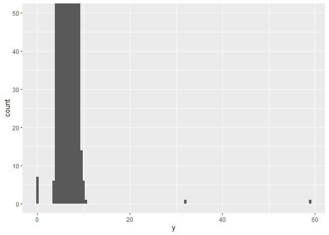

week2 script
================
2022-07-07

# 1. 라이브러리 설정하기

``` r
library(tidyverse)
```

    ## ── Attaching packages ─────────────────────────────────────── tidyverse 1.3.1 ──

    ## ✔ ggplot2 3.3.6     ✔ purrr   0.3.4
    ## ✔ tibble  3.1.7     ✔ dplyr   1.0.9
    ## ✔ tidyr   1.2.0     ✔ stringr 1.4.0
    ## ✔ readr   2.1.2     ✔ forcats 0.5.1

    ## ── Conflicts ────────────────────────────────────────── tidyverse_conflicts() ──
    ## ✖ dplyr::filter() masks stats::filter()
    ## ✖ dplyr::lag()    masks stats::lag()

``` r
library(dplyr)
library(MASS)
```

    ## 
    ## 다음의 패키지를 부착합니다: 'MASS'

    ## The following object is masked from 'package:dplyr':
    ## 
    ##     select

# 2. 데이터 타입

``` r
#numeric
x1 <- 10 #integer
x2 <- 10.2 #double

#character
x3 <- "hello"

#logical
x4 <- TRUE
x5 <- FALSE
```

## (1) 타입 확인 변수

``` r
mode(x1)
```

    ## [1] "numeric"

``` r
mode(x2)
```

    ## [1] "numeric"

``` r
mode(x3)
```

    ## [1] "character"

``` r
mode(x4)
```

    ## [1] "logical"

``` r
typeof(x1)
```

    ## [1] "double"

## (2) 데이터 타입 변환

``` r
as.character(x1)
```

    ## [1] "10"

``` r
x1 <- as.character(x1)

as.character(x4)
```

    ## [1] "TRUE"

``` r
x4 <- as.numeric(x4)

as.character(x5)
```

    ## [1] "FALSE"

``` r
x5 <- as.numeric(x5)
```

# 3. 연산자

## (1) 산술 연산자

``` r
3 + 4
```

    ## [1] 7

``` r
3 - 4
```

    ## [1] -1

``` r
3 * 4
```

    ## [1] 12

``` r
3 ** 4 # 거듭제곱
```

    ## [1] 81

``` r
3 ^ 4 # 거듭제곱
```

    ## [1] 81

``` r
4 %/% 3 # 나눗셈(몫만 구하기)
```

    ## [1] 1

``` r
13 %% 4 # 나눗셈(나머지만 구하기)
```

    ## [1] 1

## (2) 비교 연산자

``` r
3 > 4
```

    ## [1] FALSE

``` r
3 >= 4
```

    ## [1] FALSE

``` r
3 < 4
```

    ## [1] TRUE

``` r
3 <= 4
```

    ## [1] TRUE

``` r
3 == 4
```

    ## [1] FALSE

``` r
3 != 4
```

    ## [1] TRUE

``` r
!(3 == 4)
```

    ## [1] TRUE

``` r
x <- c(1, 2, 3)
y <- c(4, 1, 7)

x > y
```

    ## [1] FALSE  TRUE FALSE

## (3) 논리 연산자

``` r
# && : 그리고 
(3 > 4) && (3 < 4) # & : 하나도 가능
```

    ## [1] FALSE

``` r
# || : 또는 
(3 > 4) || (3 < 4) # | : 하나도 가능
```

    ## [1] TRUE

# 3. R의 자료구조(컴공 2학년)

## (1) Vector

하나의 열(column)로 구성되어 있음. 1차원 구조

데이터 분석의 기본 단위가 됨.

하나의 유형만 가질 수 있다.(수치, 문자, 논리)

``` r
num_vector <- c(1,2,3,4,5)
character_vector <- c("가", "나", "다", "라", "마")
logical_vector <- c(FALSE, FALSE, TRUE, TRUE, TRUE)
```

### vector 초기값

``` r
vector(mode = "numeric", length = 10)
```

    ##  [1] 0 0 0 0 0 0 0 0 0 0

``` r
vector(mode = "character", length = 10)
```

    ##  [1] "" "" "" "" "" "" "" "" "" ""

``` r
vector(mode = "logical", length = 10)
```

    ##  [1] FALSE FALSE FALSE FALSE FALSE FALSE FALSE FALSE FALSE FALSE

### vector 이름 설정

``` r
height <- c(160, 170, 180)
names(height)
```

    ## NULL

``` r
names(height) <- c("A", "B", "C")
height
```

    ##   A   B   C 
    ## 160 170 180

``` r
height["B"]
```

    ##   B 
    ## 170

### vector 정보 확인하기

``` r
length(height) # 벡터 길이
```

    ## [1] 3

``` r
mode(height) # 벡터 타입
```

    ## [1] "numeric"

``` r
is.vector(height)
```

    ## [1] TRUE

### vector 인덱싱/슬라이싱

``` r
weight <- c(10, 50, 70, 55, 56, 32)

# 1번째 요소를 보고싶다
weight[1]
```

    ## [1] 10

``` r
# 3번째 요소를 보고싶다
weight[3]
```

    ## [1] 70

``` r
# 1, 3, 5번째 요소를 보고싶다
weight[c(1, 3, 5)]
```

    ## [1] 10 70 56

``` r
# 짝수 element 확인하고 싶다
weight[seq(from = 2, to = 6, by = 2)]
```

    ## [1] 50 55 32

``` r
# 홀수 element 확인하고 싶다
weight[seq(from = 1, to = 5, by = 2)]
```

    ## [1] 10 70 56

``` r
# 슬라이싱
weight[2:length(weight)]
```

    ## [1] 50 70 55 56 32

``` r
weight[2:4]
```

    ## [1] 50 70 55

### Vectorization, Recycling Rule

``` r
x <- c(1, 2, 3, 4, 5)
y <- c(10, 20, 30, 40, 50)
z <- c(1, 2, 3)

# vectorization
x + y
```

    ## [1] 11 22 33 44 55

``` r
# recycling rule
y + z
```

    ## Warning in y + z: 두 객체의 길이가 서로 배수관계에 있지 않습니다

    ## [1] 11 22 33 41 52

## (2) Factor

범주형 자료를 생성할 수 있는 1차원 구조

하나의 데이터 유형만 가진다.

ordered = TRUE : 순서형 자료

``` r
at <- c("A", "B", "C", "A", "B")

at1 <- factor(at, levels = c("B", "A", "C"))
at2 <- factor(at, levels = c("B", "A", "C"), ordered = TRUE)
```

Factor의 인덱싱, 슬라이싱은 vector와 동일

### Factor의 속성

``` r
nlevels(at1) # 범주의 수
```

    ## [1] 3

``` r
is.factor(at1)
```

    ## [1] TRUE

## (3) Matrix

행렬이라고 부르는 행(row)와 열(column)로 구성된 2차원 구조.

머신러닝 + 통계 수식에서 많이 쓰이게 된다.

Vector의 확장 버전.

### 여러개의 벡터를 합쳐서 Matrix 만들기

``` r
v1 <- 1:3
v2 <- 4:6
v3 <- 7:9

matrix1 <- rbind(v1, v2, v3)
matrix2 <- cbind(v1, v2, v3)

matrix1
```

    ##    [,1] [,2] [,3]
    ## v1    1    2    3
    ## v2    4    5    6
    ## v3    7    8    9

``` r
matrix2
```

    ##      v1 v2 v3
    ## [1,]  1  4  7
    ## [2,]  2  5  8
    ## [3,]  3  6  9

### matrix 함수로 만들기

``` r
matrix3 <- matrix(data = 1:9, nrow = 3, ncol = 3) #cbind default
matrix3 <- matrix(data = 1:9, nrow = 3)
matrix3
```

    ##      [,1] [,2] [,3]
    ## [1,]    1    4    7
    ## [2,]    2    5    8
    ## [3,]    3    6    9

### matrix의 속성

``` r
nrow(matrix1) #행
```

    ## [1] 3

``` r
ncol(matrix2) #열 #vector는 length
```

    ## [1] 3

``` r
rownames(matrix1)
```

    ## [1] "v1" "v2" "v3"

``` r
colnames(matrix1)
```

    ## NULL

``` r
dim(matrix1) #결과도 벡터 꼴
```

    ## [1] 3 3

``` r
dim(matrix1)[2]
```

    ## [1] 3

### matrix의 인덱싱/슬라이싱

``` r
M <- mvrnorm(n = 10, mu = rep(0, times = 10), Sigma = diag(10))
M
```

    ##              [,1]       [,2]       [,3]        [,4]        [,5]        [,6]
    ##  [1,] -0.16040600  0.9534418 -2.5599207 -0.93622290 -0.58195006 -1.95674421
    ##  [2,] -0.98181044 -0.2211772  1.0911444  0.01254119  0.70712174 -0.36489104
    ##  [3,]  0.60593558  0.3213360 -1.4534801  1.04635561  0.49665474  0.60233997
    ##  [4,]  0.76883510  1.0981196 -1.0781642 -0.34234056 -1.94136596  0.71980165
    ##  [5,]  0.02880078 -0.9306053 -0.3105479 -0.33474743  0.83325916  0.45179911
    ##  [6,] -0.40637588 -0.9263921  0.9916615 -0.32816749  0.05706084 -0.05210472
    ##  [7,] -2.01029576  0.3074521 -1.1871117 -0.11463831  0.53007697  0.56486150
    ##  [8,]  0.15042020 -0.1856143  1.2600606  0.88271522 -2.10104839 -0.49124684
    ##  [9,]  1.76360322 -0.2483258 -0.5904518  0.13621103 -0.60712875  1.37315109
    ## [10,]  2.42727307  0.2645987 -1.0876323  1.01056255 -2.25645391  0.28167543
    ##             [,7]       [,8]       [,9]       [,10]
    ##  [1,] -0.1777012 -0.4386398  1.3507629 -0.04534148
    ##  [2,] -0.7853107  0.3873684  0.2370925 -0.24292186
    ##  [3,] -0.1441119 -0.2364104  0.1415451  0.21706168
    ##  [4,] -0.5655651  0.7669159 -1.7208655  0.06465615
    ##  [5,] -0.3515582  0.6147583 -0.1869576 -0.30600561
    ##  [6,]  0.9798844 -1.1515264 -0.1012318 -0.01713601
    ##  [7,]  0.2284982 -1.5386916  0.1328176 -0.32599855
    ##  [8,]  0.8839593 -1.3342709  0.6478715  0.24844283
    ##  [9,] -0.1552424  0.6708884  0.1516119  0.70303782
    ## [10,]  2.5005362  0.7304195 -0.1685306 -0.21008983

``` r
#인덱싱 예시
M[1,]
```

    ##  [1] -0.16040600  0.95344180 -2.55992071 -0.93622290 -0.58195006 -1.95674421
    ##  [7] -0.17770124 -0.43863976  1.35076293 -0.04534148

``` r
M[,1]
```

    ##  [1] -0.16040600 -0.98181044  0.60593558  0.76883510  0.02880078 -0.40637588
    ##  [7] -2.01029576  0.15042020  1.76360322  2.42727307

``` r
#슬라이싱 예시
M[1:5, ]
```

    ##             [,1]       [,2]       [,3]        [,4]       [,5]       [,6]
    ## [1,] -0.16040600  0.9534418 -2.5599207 -0.93622290 -0.5819501 -1.9567442
    ## [2,] -0.98181044 -0.2211772  1.0911444  0.01254119  0.7071217 -0.3648910
    ## [3,]  0.60593558  0.3213360 -1.4534801  1.04635561  0.4966547  0.6023400
    ## [4,]  0.76883510  1.0981196 -1.0781642 -0.34234056 -1.9413660  0.7198016
    ## [5,]  0.02880078 -0.9306053 -0.3105479 -0.33474743  0.8332592  0.4517991
    ##            [,7]       [,8]       [,9]       [,10]
    ## [1,] -0.1777012 -0.4386398  1.3507629 -0.04534148
    ## [2,] -0.7853107  0.3873684  0.2370925 -0.24292186
    ## [3,] -0.1441119 -0.2364104  0.1415451  0.21706168
    ## [4,] -0.5655651  0.7669159 -1.7208655  0.06465615
    ## [5,] -0.3515582  0.6147583 -0.1869576 -0.30600561

``` r
M[, 1:5]
```

    ##              [,1]       [,2]       [,3]        [,4]        [,5]
    ##  [1,] -0.16040600  0.9534418 -2.5599207 -0.93622290 -0.58195006
    ##  [2,] -0.98181044 -0.2211772  1.0911444  0.01254119  0.70712174
    ##  [3,]  0.60593558  0.3213360 -1.4534801  1.04635561  0.49665474
    ##  [4,]  0.76883510  1.0981196 -1.0781642 -0.34234056 -1.94136596
    ##  [5,]  0.02880078 -0.9306053 -0.3105479 -0.33474743  0.83325916
    ##  [6,] -0.40637588 -0.9263921  0.9916615 -0.32816749  0.05706084
    ##  [7,] -2.01029576  0.3074521 -1.1871117 -0.11463831  0.53007697
    ##  [8,]  0.15042020 -0.1856143  1.2600606  0.88271522 -2.10104839
    ##  [9,]  1.76360322 -0.2483258 -0.5904518  0.13621103 -0.60712875
    ## [10,]  2.42727307  0.2645987 -1.0876323  1.01056255 -2.25645391

### matrix의 연산

``` r
matrix1 %*% matrix2 #행렬곱
```

    ##    v1  v2  v3
    ## v1 14  32  50
    ## v2 32  77 122
    ## v3 50 122 194

``` r
inverse_M <- solve(M)

inverse_M %*% M #역행렬 확인
```

    ##                [,1]          [,2]          [,3]          [,4]          [,5]
    ##  [1,]  1.000000e+00 -1.942890e-15  2.442491e-15  2.220446e-16  5.329071e-15
    ##  [2,]  4.440892e-16  1.000000e+00  2.220446e-15  8.881784e-16  3.996803e-15
    ##  [3,]  0.000000e+00 -1.637579e-15  1.000000e+00 -3.330669e-16  2.886580e-15
    ##  [4,]  8.881784e-16  9.436896e-16 -2.775558e-15  1.000000e+00 -3.330669e-15
    ##  [5,] -3.330669e-16  4.024558e-16 -8.326673e-16 -5.551115e-17  1.000000e+00
    ##  [6,]  4.440892e-16 -4.718448e-16  1.998401e-15  5.551115e-16  1.332268e-15
    ##  [7,]  4.440892e-16  8.326673e-16 -2.442491e-15 -1.110223e-15 -4.440892e-16
    ##  [8,]  1.332268e-15  1.776357e-15 -6.439294e-15 -4.440892e-16 -1.776357e-15
    ##  [9,] -2.220446e-16 -7.494005e-16  2.331468e-15  6.661338e-16  1.554312e-15
    ## [10,] -5.329071e-15  3.330669e-15 -7.549517e-15 -3.108624e-15 -7.105427e-15
    ##                [,6]          [,7]          [,8]          [,9]         [,10]
    ##  [1,]  3.663736e-15  8.881784e-16  3.774758e-15 -1.720846e-15 -1.720846e-15
    ##  [2,]  5.606626e-15 -2.220446e-15  3.108624e-15 -1.554312e-15  3.885781e-16
    ##  [3,]  1.415534e-15  1.554312e-15  5.551115e-16 -8.049117e-16 -5.273559e-16
    ##  [4,] -2.470246e-15 -1.332268e-15 -1.776357e-15  1.887379e-15  1.193490e-15
    ##  [5,]  1.387779e-15 -2.664535e-15  3.302913e-15 -4.510281e-16 -3.053113e-16
    ##  [6,]  1.000000e+00  1.110223e-15  2.331468e-15 -1.193490e-15 -5.551115e-16
    ##  [7,] -2.386980e-15  1.000000e+00  3.330669e-16  1.554312e-15  8.326673e-17
    ##  [8,] -4.107825e-15 -4.884981e-15  1.000000e+00  3.386180e-15  3.330669e-16
    ##  [9,]  2.220446e-15  2.220446e-15  8.326673e-16  1.000000e+00 -8.326673e-17
    ## [10,] -1.298961e-14 -1.243450e-14 -2.220446e-15  5.995204e-15  1.000000e+00

solve(a, b) 함수는 가우스-조르단 소거법(첨가행렬법)


a = A, b = b에 대응된다.

``` r
inverse_M <- solve(a = M, b = diag(10))

inverse_M %*% M
```

    ##                [,1]          [,2]          [,3]          [,4]          [,5]
    ##  [1,]  1.000000e+00 -1.942890e-15  2.442491e-15  2.220446e-16  5.329071e-15
    ##  [2,]  4.440892e-16  1.000000e+00  2.220446e-15  8.881784e-16  3.996803e-15
    ##  [3,]  0.000000e+00 -1.637579e-15  1.000000e+00 -3.330669e-16  2.886580e-15
    ##  [4,]  8.881784e-16  9.436896e-16 -2.775558e-15  1.000000e+00 -3.330669e-15
    ##  [5,] -3.330669e-16  4.024558e-16 -8.326673e-16 -5.551115e-17  1.000000e+00
    ##  [6,]  4.440892e-16 -4.718448e-16  1.998401e-15  5.551115e-16  1.332268e-15
    ##  [7,]  4.440892e-16  8.326673e-16 -2.442491e-15 -1.110223e-15 -4.440892e-16
    ##  [8,]  1.332268e-15  1.776357e-15 -6.439294e-15 -4.440892e-16 -1.776357e-15
    ##  [9,] -2.220446e-16 -7.494005e-16  2.331468e-15  6.661338e-16  1.554312e-15
    ## [10,] -5.329071e-15  3.330669e-15 -7.549517e-15 -3.108624e-15 -7.105427e-15
    ##                [,6]          [,7]          [,8]          [,9]         [,10]
    ##  [1,]  3.663736e-15  8.881784e-16  3.774758e-15 -1.720846e-15 -1.720846e-15
    ##  [2,]  5.606626e-15 -2.220446e-15  3.108624e-15 -1.554312e-15  3.885781e-16
    ##  [3,]  1.415534e-15  1.554312e-15  5.551115e-16 -8.049117e-16 -5.273559e-16
    ##  [4,] -2.470246e-15 -1.332268e-15 -1.776357e-15  1.887379e-15  1.193490e-15
    ##  [5,]  1.387779e-15 -2.664535e-15  3.302913e-15 -4.510281e-16 -3.053113e-16
    ##  [6,]  1.000000e+00  1.110223e-15  2.331468e-15 -1.193490e-15 -5.551115e-16
    ##  [7,] -2.386980e-15  1.000000e+00  3.330669e-16  1.554312e-15  8.326673e-17
    ##  [8,] -4.107825e-15 -4.884981e-15  1.000000e+00  3.386180e-15  3.330669e-16
    ##  [9,]  2.220446e-15  2.220446e-15  8.326673e-16  1.000000e+00 -8.326673e-17
    ## [10,] -1.298961e-14 -1.243450e-14 -2.220446e-15  5.995204e-15  1.000000e+00


``` r
solve(a = M, b = rep(0, times = 10))
```

    ##  [1] 0 0 0 0 0 0 0 0 0 0

## (4) Array

3차원 이상의 구조, deep learning에서 사용되는 음성, 이미지, 영상 데이터
정보를 표현하기 위해 사용된다.

``` r
array1 <- array(1:5, dim = c(2,2,2))

array1 #recycling rule
```

    ## , , 1
    ## 
    ##      [,1] [,2]
    ## [1,]    1    3
    ## [2,]    2    4
    ## 
    ## , , 2
    ## 
    ##      [,1] [,2]
    ## [1,]    5    2
    ## [2,]    1    3

## (5) Data frame

행과 열로 구성되어 있으며 각 열(column)마다 서로 다른 데이터 타입을 가질
수 있다.

``` r
v1 <- c(1,2,3)
v2 <- c("A", "B", "c")
v3 <- factor(c("양성", "음성", "음성"), levels = c("음성", "양성"))

df1 <- data.frame(v1, v2, v3)
View(df1)
df2 <- data.frame(`번호`= v1, `코드` = v2, `판정` = v3)

df2$코드
```

    ## [1] "A" "B" "c"

## (6) List

1차원 자료 구조. 모든 자료 구조(vector, matrix, dataframe)를 전부 포함할
수 있다.

일반적으로 모델 분석 결과를 저장하는 형식이 된다.

``` r
list1 <- list(v1, matrix1, df2)
list2 <- list(list1, v1, matrix1, df2)
names(list2) <- c("list", "vector", "matrix", "dataframe")

list2$list
```

    ## [[1]]
    ## [1] 1 2 3
    ## 
    ## [[2]]
    ##    [,1] [,2] [,3]
    ## v1    1    2    3
    ## v2    4    5    6
    ## v3    7    8    9
    ## 
    ## [[3]]
    ##   번호 코드 판정
    ## 1    1    A 양성
    ## 2    2    B 음성
    ## 3    3    c 음성

``` r
list2$vector
```

    ## [1] 1 2 3

``` r
list2[[2]] #return = 원래 자기 형식(벡터)
```

    ## [1] 1 2 3

``` r
list2[2] #return = list
```

    ## $vector
    ## [1] 1 2 3

``` r
mode(list2[2])
```

    ## [1] "list"

``` r
mode(list2[[2]])
```

    ## [1] "numeric"

# 5. 데이터 저장/불러오기

## (1) txt 파일

txt문서 작성: write.table

txt문서 읽기: read.table

``` r
w1 <- read.table(file = "C:\\Users\\ddee9\\OneDrive\\문서\\r code\\example1.txt", sep = ",", header = TRUE)

View(w1)

w2 <- read.table(file = "C:\\Users\\ddee9\\OneDrive\\문서\\r code\\example2.txt", sep = " ", header = TRUE)

View(w2)

w3 <- read.table(file = "C:\\Users\\ddee9\\OneDrive\\문서\\r code\\example3.txt", sep = "\t", header = TRUE) #tab으로 구분

View(w3)
```

## (2) CSV 파일

readr::write_csv, readr::read_csv

``` r
w <- read_csv(file = "C:\\Users\\ddee9\\OneDrive\\문서\\r code\\example.csv", col_names = TRUE)
```

    ## Rows: 100 Columns: 10
    ## ── Column specification ────────────────────────────────────────────────────────
    ## Delimiter: ","
    ## dbl (10): V1, V2, V3, V4, V5, V6, V7, V8, V9, V10
    ## 
    ## ℹ Use `spec()` to retrieve the full column specification for this data.
    ## ℹ Specify the column types or set `show_col_types = FALSE` to quiet this message.

``` r
View(w)
```

excel, SQL, SAS, SPSS 등의 파일들도 읽어올 수 있음

다른 패키지 필요함.

``` r
library(nycflights13)
library(tidyverse)
```

dplyr **핵심 함수**

|   함수명   |           기능           |
|:----------:|:------------------------:|
|  filter()  |  값을 기준으로 행 선택   |
|  select()  | 이름으로 열(변수)을 선택 |
|  mutate()  |                          |
| arrange()  |                          |
| summarize  | 하나의 요약값으로 만들기 |
| group_by() | 그룹마다 동작하도록 설정 |

위의 함수들은 다음과 같은 공통점이 있다. (1) 첫 인수는 데이터프레임이다.
(2) 그 이후의 인수들은 따옴표없이 변수 이름을 사용한다. (3)
데이터프레임으로 반환한다.

``` r
str(flights)
```

    ## tibble [336,776 × 19] (S3: tbl_df/tbl/data.frame)
    ##  $ year          : int [1:336776] 2013 2013 2013 2013 2013 2013 2013 2013 2013 2013 ...
    ##  $ month         : int [1:336776] 1 1 1 1 1 1 1 1 1 1 ...
    ##  $ day           : int [1:336776] 1 1 1 1 1 1 1 1 1 1 ...
    ##  $ dep_time      : int [1:336776] 517 533 542 544 554 554 555 557 557 558 ...
    ##  $ sched_dep_time: int [1:336776] 515 529 540 545 600 558 600 600 600 600 ...
    ##  $ dep_delay     : num [1:336776] 2 4 2 -1 -6 -4 -5 -3 -3 -2 ...
    ##  $ arr_time      : int [1:336776] 830 850 923 1004 812 740 913 709 838 753 ...
    ##  $ sched_arr_time: int [1:336776] 819 830 850 1022 837 728 854 723 846 745 ...
    ##  $ arr_delay     : num [1:336776] 11 20 33 -18 -25 12 19 -14 -8 8 ...
    ##  $ carrier       : chr [1:336776] "UA" "UA" "AA" "B6" ...
    ##  $ flight        : int [1:336776] 1545 1714 1141 725 461 1696 507 5708 79 301 ...
    ##  $ tailnum       : chr [1:336776] "N14228" "N24211" "N619AA" "N804JB" ...
    ##  $ origin        : chr [1:336776] "EWR" "LGA" "JFK" "JFK" ...
    ##  $ dest          : chr [1:336776] "IAH" "IAH" "MIA" "BQN" ...
    ##  $ air_time      : num [1:336776] 227 227 160 183 116 150 158 53 140 138 ...
    ##  $ distance      : num [1:336776] 1400 1416 1089 1576 762 ...
    ##  $ hour          : num [1:336776] 5 5 5 5 6 5 6 6 6 6 ...
    ##  $ minute        : num [1:336776] 15 29 40 45 0 58 0 0 0 0 ...
    ##  $ time_hour     : POSIXct[1:336776], format: "2013-01-01 05:00:00" "2013-01-01 05:00:00" ...

``` r
month1_day1 <- dplyr::filter(flights, month == 1, day == 1)

flights %>% filter(month == 11 | month == 12)
```

    ## # A tibble: 55,403 × 19
    ##     year month   day dep_time sched_dep_time dep_delay arr_time sched_arr_time
    ##    <int> <int> <int>    <int>          <int>     <dbl>    <int>          <int>
    ##  1  2013    11     1        5           2359         6      352            345
    ##  2  2013    11     1       35           2250       105      123           2356
    ##  3  2013    11     1      455            500        -5      641            651
    ##  4  2013    11     1      539            545        -6      856            827
    ##  5  2013    11     1      542            545        -3      831            855
    ##  6  2013    11     1      549            600       -11      912            923
    ##  7  2013    11     1      550            600       -10      705            659
    ##  8  2013    11     1      554            600        -6      659            701
    ##  9  2013    11     1      554            600        -6      826            827
    ## 10  2013    11     1      554            600        -6      749            751
    ## # … with 55,393 more rows, and 11 more variables: arr_delay <dbl>,
    ## #   carrier <chr>, flight <int>, tailnum <chr>, origin <chr>, dest <chr>,
    ## #   air_time <dbl>, distance <dbl>, hour <dbl>, minute <dbl>, time_hour <dttm>

``` r
flights %>% filter(month %in% c(11, 12)) %>% head() %>% View() #pipe

#아래 두 식은 동일한 표현이다.
filter(flights, !(arr_delay > 120 | dep_delay > 120))
```

    ## # A tibble: 316,050 × 19
    ##     year month   day dep_time sched_dep_time dep_delay arr_time sched_arr_time
    ##    <int> <int> <int>    <int>          <int>     <dbl>    <int>          <int>
    ##  1  2013     1     1      517            515         2      830            819
    ##  2  2013     1     1      533            529         4      850            830
    ##  3  2013     1     1      542            540         2      923            850
    ##  4  2013     1     1      544            545        -1     1004           1022
    ##  5  2013     1     1      554            600        -6      812            837
    ##  6  2013     1     1      554            558        -4      740            728
    ##  7  2013     1     1      555            600        -5      913            854
    ##  8  2013     1     1      557            600        -3      709            723
    ##  9  2013     1     1      557            600        -3      838            846
    ## 10  2013     1     1      558            600        -2      753            745
    ## # … with 316,040 more rows, and 11 more variables: arr_delay <dbl>,
    ## #   carrier <chr>, flight <int>, tailnum <chr>, origin <chr>, dest <chr>,
    ## #   air_time <dbl>, distance <dbl>, hour <dbl>, minute <dbl>, time_hour <dttm>

``` r
filter(flights, arr_delay <= 120 & dep_delay <= 120) #드모르간 법칙
```

    ## # A tibble: 316,050 × 19
    ##     year month   day dep_time sched_dep_time dep_delay arr_time sched_arr_time
    ##    <int> <int> <int>    <int>          <int>     <dbl>    <int>          <int>
    ##  1  2013     1     1      517            515         2      830            819
    ##  2  2013     1     1      533            529         4      850            830
    ##  3  2013     1     1      542            540         2      923            850
    ##  4  2013     1     1      544            545        -1     1004           1022
    ##  5  2013     1     1      554            600        -6      812            837
    ##  6  2013     1     1      554            558        -4      740            728
    ##  7  2013     1     1      555            600        -5      913            854
    ##  8  2013     1     1      557            600        -3      709            723
    ##  9  2013     1     1      557            600        -3      838            846
    ## 10  2013     1     1      558            600        -2      753            745
    ## # … with 316,040 more rows, and 11 more variables: arr_delay <dbl>,
    ## #   carrier <chr>, flight <int>, tailnum <chr>, origin <chr>, dest <chr>,
    ## #   air_time <dbl>, distance <dbl>, hour <dbl>, minute <dbl>, time_hour <dttm>

``` r
df <- data.frame(x = c(1, NA, 3))
filter(df, x > 1) # NA 제외시킴
```

    ##   x
    ## 1 3

1)  dest가 IAH 또는 HOU으로 운항하는 행을 찾아라.
2)  carrier가 UA 혹은 AA 혹은 DL 인 행을 찾아라.

``` r
filter(flights, dest == "IAH" | dest == "HOU")
```

    ## # A tibble: 9,313 × 19
    ##     year month   day dep_time sched_dep_time dep_delay arr_time sched_arr_time
    ##    <int> <int> <int>    <int>          <int>     <dbl>    <int>          <int>
    ##  1  2013     1     1      517            515         2      830            819
    ##  2  2013     1     1      533            529         4      850            830
    ##  3  2013     1     1      623            627        -4      933            932
    ##  4  2013     1     1      728            732        -4     1041           1038
    ##  5  2013     1     1      739            739         0     1104           1038
    ##  6  2013     1     1      908            908         0     1228           1219
    ##  7  2013     1     1     1028           1026         2     1350           1339
    ##  8  2013     1     1     1044           1045        -1     1352           1351
    ##  9  2013     1     1     1114            900       134     1447           1222
    ## 10  2013     1     1     1205           1200         5     1503           1505
    ## # … with 9,303 more rows, and 11 more variables: arr_delay <dbl>,
    ## #   carrier <chr>, flight <int>, tailnum <chr>, origin <chr>, dest <chr>,
    ## #   air_time <dbl>, distance <dbl>, hour <dbl>, minute <dbl>, time_hour <dttm>

``` r
filter(flights, carrier %in% c("UA", "AA", "DL"))
```

    ## # A tibble: 139,504 × 19
    ##     year month   day dep_time sched_dep_time dep_delay arr_time sched_arr_time
    ##    <int> <int> <int>    <int>          <int>     <dbl>    <int>          <int>
    ##  1  2013     1     1      517            515         2      830            819
    ##  2  2013     1     1      533            529         4      850            830
    ##  3  2013     1     1      542            540         2      923            850
    ##  4  2013     1     1      554            600        -6      812            837
    ##  5  2013     1     1      554            558        -4      740            728
    ##  6  2013     1     1      558            600        -2      753            745
    ##  7  2013     1     1      558            600        -2      924            917
    ##  8  2013     1     1      558            600        -2      923            937
    ##  9  2013     1     1      559            600        -1      941            910
    ## 10  2013     1     1      559            600        -1      854            902
    ## # … with 139,494 more rows, and 11 more variables: arr_delay <dbl>,
    ## #   carrier <chr>, flight <int>, tailnum <chr>, origin <chr>, dest <chr>,
    ## #   air_time <dbl>, distance <dbl>, hour <dbl>, minute <dbl>, time_hour <dttm>

## arrange()로 행 정렬하기

``` r
# year, month, day 순으로로 오름차순 정렬
arrange(flights, year, month, day)
```

    ## # A tibble: 336,776 × 19
    ##     year month   day dep_time sched_dep_time dep_delay arr_time sched_arr_time
    ##    <int> <int> <int>    <int>          <int>     <dbl>    <int>          <int>
    ##  1  2013     1     1      517            515         2      830            819
    ##  2  2013     1     1      533            529         4      850            830
    ##  3  2013     1     1      542            540         2      923            850
    ##  4  2013     1     1      544            545        -1     1004           1022
    ##  5  2013     1     1      554            600        -6      812            837
    ##  6  2013     1     1      554            558        -4      740            728
    ##  7  2013     1     1      555            600        -5      913            854
    ##  8  2013     1     1      557            600        -3      709            723
    ##  9  2013     1     1      557            600        -3      838            846
    ## 10  2013     1     1      558            600        -2      753            745
    ## # … with 336,766 more rows, and 11 more variables: arr_delay <dbl>,
    ## #   carrier <chr>, flight <int>, tailnum <chr>, origin <chr>, dest <chr>,
    ## #   air_time <dbl>, distance <dbl>, hour <dbl>, minute <dbl>, time_hour <dttm>

``` r
# month를 내림차순으로 정렬
arrange(flights, year, desc(month))
```

    ## # A tibble: 336,776 × 19
    ##     year month   day dep_time sched_dep_time dep_delay arr_time sched_arr_time
    ##    <int> <int> <int>    <int>          <int>     <dbl>    <int>          <int>
    ##  1  2013    12     1       13           2359        14      446            445
    ##  2  2013    12     1       17           2359        18      443            437
    ##  3  2013    12     1      453            500        -7      636            651
    ##  4  2013    12     1      520            515         5      749            808
    ##  5  2013    12     1      536            540        -4      845            850
    ##  6  2013    12     1      540            550       -10     1005           1027
    ##  7  2013    12     1      541            545        -4      734            755
    ##  8  2013    12     1      546            545         1      826            835
    ##  9  2013    12     1      549            600       -11      648            659
    ## 10  2013    12     1      550            600       -10      825            854
    ## # … with 336,766 more rows, and 11 more variables: arr_delay <dbl>,
    ## #   carrier <chr>, flight <int>, tailnum <chr>, origin <chr>, dest <chr>,
    ## #   air_time <dbl>, distance <dbl>, hour <dbl>, minute <dbl>, time_hour <dttm>

``` r
# NA 값 가장 앞으
arrange(flights, year, desc(is.na(dep_time)))
```

    ## # A tibble: 336,776 × 19
    ##     year month   day dep_time sched_dep_time dep_delay arr_time sched_arr_time
    ##    <int> <int> <int>    <int>          <int>     <dbl>    <int>          <int>
    ##  1  2013     1     1       NA           1630        NA       NA           1815
    ##  2  2013     1     1       NA           1935        NA       NA           2240
    ##  3  2013     1     1       NA           1500        NA       NA           1825
    ##  4  2013     1     1       NA            600        NA       NA            901
    ##  5  2013     1     2       NA           1540        NA       NA           1747
    ##  6  2013     1     2       NA           1620        NA       NA           1746
    ##  7  2013     1     2       NA           1355        NA       NA           1459
    ##  8  2013     1     2       NA           1420        NA       NA           1644
    ##  9  2013     1     2       NA           1321        NA       NA           1536
    ## 10  2013     1     2       NA           1545        NA       NA           1910
    ## # … with 336,766 more rows, and 11 more variables: arr_delay <dbl>,
    ## #   carrier <chr>, flight <int>, tailnum <chr>, origin <chr>, dest <chr>,
    ## #   air_time <dbl>, distance <dbl>, hour <dbl>, minute <dbl>, time_hour <dttm>

## (3) select()로 열 선택하기

starts_with(“char”) : 해당 문자로 시작하는 변수에 매칭

ends_with(“char”) : 해당 문자로 끝나는 변수에 매칭

contains(“char”) : 해당 문자를 포함하는 변수에 매칭

matches(“(.)\\1”) : 정규표현식에 매칭되는 변수 선택

num_range(“x”, 1:3) : x1, x2, x3에 매칭되는 변수 선택

``` r
dplyr::select(flights, year, month, day)
```

    ## # A tibble: 336,776 × 3
    ##     year month   day
    ##    <int> <int> <int>
    ##  1  2013     1     1
    ##  2  2013     1     1
    ##  3  2013     1     1
    ##  4  2013     1     1
    ##  5  2013     1     1
    ##  6  2013     1     1
    ##  7  2013     1     1
    ##  8  2013     1     1
    ##  9  2013     1     1
    ## 10  2013     1     1
    ## # … with 336,766 more rows

``` r
dplyr::select(flights, year:day)
```

    ## # A tibble: 336,776 × 3
    ##     year month   day
    ##    <int> <int> <int>
    ##  1  2013     1     1
    ##  2  2013     1     1
    ##  3  2013     1     1
    ##  4  2013     1     1
    ##  5  2013     1     1
    ##  6  2013     1     1
    ##  7  2013     1     1
    ##  8  2013     1     1
    ##  9  2013     1     1
    ## 10  2013     1     1
    ## # … with 336,766 more rows

``` r
dplyr::select(flights, -c(year:day)) #선택 열 제외
```

    ## # A tibble: 336,776 × 16
    ##    dep_time sched_dep_time dep_delay arr_time sched_arr_time arr_delay carrier
    ##       <int>          <int>     <dbl>    <int>          <int>     <dbl> <chr>  
    ##  1      517            515         2      830            819        11 UA     
    ##  2      533            529         4      850            830        20 UA     
    ##  3      542            540         2      923            850        33 AA     
    ##  4      544            545        -1     1004           1022       -18 B6     
    ##  5      554            600        -6      812            837       -25 DL     
    ##  6      554            558        -4      740            728        12 UA     
    ##  7      555            600        -5      913            854        19 B6     
    ##  8      557            600        -3      709            723       -14 EV     
    ##  9      557            600        -3      838            846        -8 B6     
    ## 10      558            600        -2      753            745         8 AA     
    ## # … with 336,766 more rows, and 9 more variables: flight <int>, tailnum <chr>,
    ## #   origin <chr>, dest <chr>, air_time <dbl>, distance <dbl>, hour <dbl>,
    ## #   minute <dbl>, time_hour <dttm>

``` r
dplyr::select(flights, starts_with("d"))
```

    ## # A tibble: 336,776 × 5
    ##      day dep_time dep_delay dest  distance
    ##    <int>    <int>     <dbl> <chr>    <dbl>
    ##  1     1      517         2 IAH       1400
    ##  2     1      533         4 IAH       1416
    ##  3     1      542         2 MIA       1089
    ##  4     1      544        -1 BQN       1576
    ##  5     1      554        -6 ATL        762
    ##  6     1      554        -4 ORD        719
    ##  7     1      555        -5 FLL       1065
    ##  8     1      557        -3 IAD        229
    ##  9     1      557        -3 MCO        944
    ## 10     1      558        -2 ORD        733
    ## # … with 336,766 more rows

## (4) mutate()로 새로운 변수 추가하기

``` r
sample_flights <- flights %>% dplyr::select(year:day,
                                            ends_with("delay"),
                                            distance,
                                            air_time)
head(sample_flights)
```

    ## # A tibble: 6 × 7
    ##    year month   day dep_delay arr_delay distance air_time
    ##   <int> <int> <int>     <dbl>     <dbl>    <dbl>    <dbl>
    ## 1  2013     1     1         2        11     1400      227
    ## 2  2013     1     1         4        20     1416      227
    ## 3  2013     1     1         2        33     1089      160
    ## 4  2013     1     1        -1       -18     1576      183
    ## 5  2013     1     1        -6       -25      762      116
    ## 6  2013     1     1        -4        12      719      150

``` r
dplyr::mutate(sample_flights,
              gain = arr_delay - dep_delay,
              speed = distance / air_time * 60,
              hours = air_time / 60,
              gain_per_hour = gain / hours)
```

    ## # A tibble: 336,776 × 11
    ##     year month   day dep_delay arr_delay distance air_time  gain speed hours
    ##    <int> <int> <int>     <dbl>     <dbl>    <dbl>    <dbl> <dbl> <dbl> <dbl>
    ##  1  2013     1     1         2        11     1400      227     9  370. 3.78 
    ##  2  2013     1     1         4        20     1416      227    16  374. 3.78 
    ##  3  2013     1     1         2        33     1089      160    31  408. 2.67 
    ##  4  2013     1     1        -1       -18     1576      183   -17  517. 3.05 
    ##  5  2013     1     1        -6       -25      762      116   -19  394. 1.93 
    ##  6  2013     1     1        -4        12      719      150    16  288. 2.5  
    ##  7  2013     1     1        -5        19     1065      158    24  404. 2.63 
    ##  8  2013     1     1        -3       -14      229       53   -11  259. 0.883
    ##  9  2013     1     1        -3        -8      944      140    -5  405. 2.33 
    ## 10  2013     1     1        -2         8      733      138    10  319. 2.3  
    ## # … with 336,766 more rows, and 1 more variable: gain_per_hour <dbl>

``` r
dplyr::transmute(sample_flights,
              gain = arr_delay - dep_delay,
              speed = distance / air_time * 60,
              hours = air_time / 60,
              gain_per_hour = gain / hours)
```

    ## # A tibble: 336,776 × 4
    ##     gain speed hours gain_per_hour
    ##    <dbl> <dbl> <dbl>         <dbl>
    ##  1     9  370. 3.78           2.38
    ##  2    16  374. 3.78           4.23
    ##  3    31  408. 2.67          11.6 
    ##  4   -17  517. 3.05          -5.57
    ##  5   -19  394. 1.93          -9.83
    ##  6    16  288. 2.5            6.4 
    ##  7    24  404. 2.63           9.11
    ##  8   -11  259. 0.883        -12.5 
    ##  9    -5  405. 2.33          -2.14
    ## 10    10  319. 2.3            4.35
    ## # … with 336,766 more rows

``` r
dplyr::mutate(sample_flights,
              dummy_month = ifelse(month > 6, 1, 0))
```

    ## # A tibble: 336,776 × 8
    ##     year month   day dep_delay arr_delay distance air_time dummy_month
    ##    <int> <int> <int>     <dbl>     <dbl>    <dbl>    <dbl>       <dbl>
    ##  1  2013     1     1         2        11     1400      227           0
    ##  2  2013     1     1         4        20     1416      227           0
    ##  3  2013     1     1         2        33     1089      160           0
    ##  4  2013     1     1        -1       -18     1576      183           0
    ##  5  2013     1     1        -6       -25      762      116           0
    ##  6  2013     1     1        -4        12      719      150           0
    ##  7  2013     1     1        -5        19     1065      158           0
    ##  8  2013     1     1        -3       -14      229       53           0
    ##  9  2013     1     1        -3        -8      944      140           0
    ## 10  2013     1     1        -2         8      733      138           0
    ## # … with 336,766 more rows

cumsum() : 누적 합계 cumprod() : 누적 곱셈 cummin() : 누적 최솟값
cummax() : 누적 최댓값 cummean() : 누적 평균

``` r
dplyr::mutate(sample_flights,
              cum_min = cummin(dep_delay),
              cum_max = cummax(dep_delay),
              cum_sum = cumsum(dep_delay))
```

    ## # A tibble: 336,776 × 10
    ##     year month   day dep_delay arr_delay distance air_time cum_min cum_max
    ##    <int> <int> <int>     <dbl>     <dbl>    <dbl>    <dbl>   <dbl>   <dbl>
    ##  1  2013     1     1         2        11     1400      227       2       2
    ##  2  2013     1     1         4        20     1416      227       2       4
    ##  3  2013     1     1         2        33     1089      160       2       4
    ##  4  2013     1     1        -1       -18     1576      183      -1       4
    ##  5  2013     1     1        -6       -25      762      116      -6       4
    ##  6  2013     1     1        -4        12      719      150      -6       4
    ##  7  2013     1     1        -5        19     1065      158      -6       4
    ##  8  2013     1     1        -3       -14      229       53      -6       4
    ##  9  2013     1     1        -3        -8      944      140      -6       4
    ## 10  2013     1     1        -2         8      733      138      -6       4
    ## # … with 336,766 more rows, and 1 more variable: cum_sum <dbl>

## (5) summarize()로 그룹화 요약하기

group_by를 통해 분석의 단위를 전체 데이터셋에서 개별 그룹으로 변경할 수
있다.

그룹마다 함수를 적용할 수 있다.

``` r
dplyr::summarise(flights,
                 n = n(),
                 delay = mean(dep_delay, na.rm = TRUE))
```

    ## # A tibble: 1 × 2
    ##        n delay
    ##    <int> <dbl>
    ## 1 336776  12.6

``` r
#group_by와 같이 쓸 경우
flights %>%
  dplyr::group_by(year, month) %>% 
  dplyr::summarise(n = n(),
                   delay = mean(dep_delay, na.rm = TRUE))
```

    ## `summarise()` has grouped output by 'year'. You can override using the
    ## `.groups` argument.

    ## # A tibble: 12 × 4
    ## # Groups:   year [1]
    ##     year month     n delay
    ##    <int> <int> <int> <dbl>
    ##  1  2013     1 27004 10.0 
    ##  2  2013     2 24951 10.8 
    ##  3  2013     3 28834 13.2 
    ##  4  2013     4 28330 13.9 
    ##  5  2013     5 28796 13.0 
    ##  6  2013     6 28243 20.8 
    ##  7  2013     7 29425 21.7 
    ##  8  2013     8 29327 12.6 
    ##  9  2013     9 27574  6.72
    ## 10  2013    10 28889  6.24
    ## 11  2013    11 27268  5.44
    ## 12  2013    12 28135 16.6

유용한 요약함수들

median() : 중위수

sd() : 표준편차

IQR() : 사분위 범위

mad() : 중위절대편차

quantile(x, 0.25) : 사분위수

자리 측정값 : first(), last(), nth(x, 2)

n() : 현재 그룹의 크기를 반환

``` r
flights %>%
  dplyr::select(year, month, day, dep_time) %>%
  dplyr::filter(is.na(dep_time) == FALSE) %>%
  dplyr::group_by(year, month) %>%
  dplyr::summarise(n = n(),
                   dep_mean = mean(dep_time))
```

    ## `summarise()` has grouped output by 'year'. You can override using the
    ## `.groups` argument.

    ## # A tibble: 12 × 4
    ## # Groups:   year [1]
    ##     year month     n dep_mean
    ##    <int> <int> <int>    <dbl>
    ##  1  2013     1 26483    1347.
    ##  2  2013     2 23690    1348.
    ##  3  2013     3 27973    1359.
    ##  4  2013     4 27662    1353.
    ##  5  2013     5 28233    1351.
    ##  6  2013     6 27234    1351.
    ##  7  2013     7 28485    1353.
    ##  8  2013     8 28841    1350.
    ##  9  2013     9 27122    1334.
    ## 10  2013    10 28653    1340.
    ## 11  2013    11 27035    1344.
    ## 12  2013    12 27110    1357.

# 7. 탐색적 데이터 분석(EDA)

EDA는 데이터 분석에서 가장 중요한 부분을 차지한다.

EDA의 목표는 데이터를 이해하는 것.

## (1) 변동(variation)

변수들의 고유한 변동 패턴을 파악하기 위해 변수들 값의 **분포를
시각화**하는 것이 좋다.

``` r
# 히스토그램을 통한 연속형 변수 분포 확인하기
ggplot(data = diamonds) +
  geom_histogram(mapping = aes(x = carat),
                 bins = 1000) #x축의 간격
```

<!-- -->

``` r
# cut_width를 활용하여 데이터 분포 확인하기
cut_width(diamonds$carat, 0.5) %>% table() #범주형으로 만들어서 level별 count
```

    ## .
    ## [-0.25,0.25]  (0.25,0.75]  (0.75,1.25]  (1.25,1.75]  (1.75,2.25]  (2.25,2.75] 
    ##          785        29498        15977         5313         2002          322 
    ##  (2.75,3.25]  (3.25,3.75]  (3.75,4.25]  (4.25,4.75]  (4.75,5.25] 
    ##           32            5            4            1            1

``` r
diamonds %>%
  dplyr::count(cut_width(carat, 0.5))
```

    ## # A tibble: 11 × 2
    ##    `cut_width(carat, 0.5)`     n
    ##    <fct>                   <int>
    ##  1 [-0.25,0.25]              785
    ##  2 (0.25,0.75]             29498
    ##  3 (0.75,1.25]             15977
    ##  4 (1.25,1.75]              5313
    ##  5 (1.75,2.25]              2002
    ##  6 (2.25,2.75]               322
    ##  7 (2.75,3.25]                32
    ##  8 (3.25,3.75]                 5
    ##  9 (3.75,4.25]                 4
    ## 10 (4.25,4.75]                 1
    ## 11 (4.75,5.25]                 1

``` r
# geom_freqpoly()를 사용하여 여러개의 히스토그램을 겹쳐서 그리기
ggplot(data = diamonds, mapping = aes(x = carat, color = cut)) +
  geom_freqpoly()
```

    ## `stat_bin()` using `bins = 30`. Pick better value with `binwidth`.

<!-- -->

변동의 이상값을 확인(비정상적인 관측값)

``` r
ggplot(data = diamonds) +
  geom_histogram(mapping = aes(x = y),
                 binwidth = 0.5) +
  coord_cartesian(ylim = c(0, 50))
```

<!-- -->
